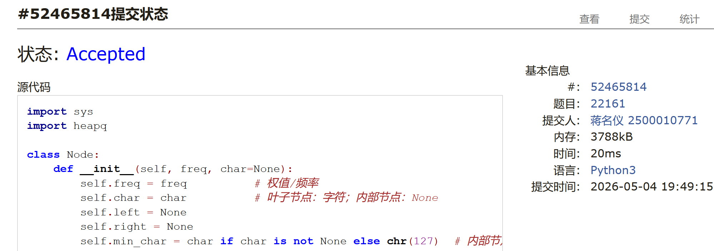

# DSA Assignment #8: 🌲（3/3）

*Updated 2026-04-21 19:09 GMT+8*
 *Compiled by <mark>蒋名仪 2500010771</mark> (2026 Spring)*


>**说明：**
>
>1. **解题与记录：**
>
>     对于每一个题目，请提供其解题思路（可选），并附上使用Python或C++编写的源代码（确保已在OpenJudge， Codeforces，LeetCode等平台上获得Accepted）。请将这些信息连同显示“Accepted”的截图一起填写到下方的作业模板中。（推荐使用Typora https://typoraio.cn 进行编辑，当然你也可以选择Word。）无论题目是否已通过，请标明每个题目大致花费的时间。
>
>2. **提交安排：**提交时，请首先上传PDF格式的文件，并将.md或.doc格式的文件作为附件上传至右侧的“作业评论”区。确保你的Canvas账户有一个清晰可见的本人头像，提交的文件为PDF格式，并且“作业评论”区包含上传的.md或.doc附件。
> 
>3. **延迟提交：**如果你预计无法在截止日期前提交作业，请提前告知具体原因。这有助于我们了解情况并可能为你提供适当的延期或其他帮助。  
>
>请按照上述指导认真准备和提交作业，以保证顺利完成课程要求。


## 1. 题目

### M晴问9.7: 向下调整构建大顶堆

手搓堆, https://sunnywhy.com/sfbj/9/7

思路：
刚开始还想要硬是建一个树，后面发现直接调整数组就行了


代码：

```python
n=int(input())
arr = list(map(int, input().split()))
def heapify(arr, n, i):
    largest = i
    l = 2 * i + 1
    r = 2 * i + 2
    if l < n and arr[l] > arr[largest]:
        largest = l
    if r < n and arr[r] > arr[largest]:
        largest = r
    if largest != i:
        arr[i], arr[largest] = arr[largest], arr[i]
        heapify(arr, n, largest)
for i in range(n // 2 - 1, -1, -1):
    heapify(arr, n, i)
print(' '.join(map(str, arr)))
```


代码运行截图 <mark>（至少包含有"Accepted"）</mark>
这个我登录不上晴问所以没办法，但是问了ai应该是对的


### M1722.执行交换操作后的最小汉明距离

dsu, https://leetcode.cn/problems/minimize-hamming-distance-after-swap-operations/


思路：
就是并查集没什么好说的，但是太久没写了导致语法错了好几个，，


代码：

```python
class Solution:
    def minimumHammingDistance(self, source: List[int], target: List[int], allowedSwaps: List[List[int]]) -> int:
        parent=[i for i in range(len(source))]
        def find(i):
            cur=i
            parent_n=parent[cur]
            if parent[cur]!=cur:
                parent_n=find(parent[cur])
                parent[cur]=parent_n
            return parent_n
        def union(i,j):
            if find(i)==find(j):
                return
            else:
                parent[find(i)]=find(j)
        for i,j in allowedSwaps:
            union(i,j)
        dic={}
        groups=[]
        j=0
        for i in range(len(source)):
            root=find(i)
            if root not in dic:
                dic[root]=j
                j+=1
                groups.append([[source[i]],[target[i]]])
            else:
                groups[dic[root]][0].append(source[i])
                groups[dic[root]][1].append(target[i])
        ans=0
        for l1,l2 in groups:
            l1.sort()
            l2.sort()
            i=0
            j=0
            while i<len(l1) and j< len(l2):
                if l1[i]==l2[j]:
                    ans+=1
                    i+=1
                    j+=1
                elif l1[i]<l2[j]:
                    i+=1
                else:
                    j+=1
        return len(source)-ans
```


代码运行截图 <mark>（至少包含有"Accepted"）</mark>


### T22161: 哈夫曼编码树

greedy, http://cs101.openjudge.cn/practice/22161/

思路：
用贪心聚合没啥好说的，但是这个我还是用的太不熟练了，，

代码：

```python
import sys
import heapq

class Node:
    def __init__(self, freq, char=None):
        self.freq = freq          # 权值/频率
        self.char = char          # 叶子节点：字符；内部节点：None
        self.left = None
        self.right = None
        self.min_char = char if char is not None else chr(127)  #最大值

    def __lt__(self, other):
        if self.freq != other.freq:
            return self.freq < other.freq
        return self.min_char < other.min_char

def build_huffman_tree(char_freq):
    """根据字符频率字典构建哈夫曼树，返回根节点"""
    heap = []
    for ch, freq in char_freq.items():
        node = Node(freq, ch)
        node.min_char = ch
        heapq.heappush(heap, node)

    while len(heap) > 1:
        left = heapq.heappop(heap)   # 较小的节点
        right = heapq.heappop(heap)  # 较大的节点
        parent = Node(left.freq + right.freq)
        parent.left = left
        parent.right = right
        parent.min_char = min(left.min_char, right.min_char)
        heapq.heappush(heap, parent)

    return heap[0] if heap else None

def generate_codes(root):
    codes = {}
    def dfs(node, code):
        if node.left is None and node.right is None:
            codes[node.char] = code
            return
        if node.left:
            dfs(node.left, code + '0')
        if node.right:
            dfs(node.right, code + '1')
    if root:
        dfs(root, '')
    return codes

def huffman_encode(text, codes):
    return ''.join(codes[ch] for ch in text)

def huffman_decode(bits, root):
    if not bits:
        return ""
    result = []
    node = root
    for bit in bits:
        if bit == '0':
            node = node.left
        else:
            node = node.right
        if node.left is None and node.right is None:
            result.append(node.char)
            node = root
    return ''.join(result)

def main():
    data = sys.stdin.read().splitlines()
    if not data:
        return
    n = int(data[0].strip())
    char_freq = {}
    for i in range(1, n+1):
        line = data[i].strip()
        if not line:
            continue
        parts = line.split()
        ch = parts[0]
        freq = int(parts[1])
        char_freq[ch] = freq

    root = build_huffman_tree(char_freq)
    codes = generate_codes(root)

    # 处理剩余行
    for line in data[n+1:]:
        line = line.strip()
        if not line:
            continue
        # 判断是二进制串还是字母串
        if all(c in '01' for c in line):
            # 解码
            print(huffman_decode(line, root))
        else:
            # 编码
            print(huffman_encode(line, codes))

if __name__ == '__main__':
    main()
```


代码运行截图 <mark>（至少包含有"Accepted"）</mark>




### M晴问9.5: 平衡二叉树的建立

手搓AVL, https://sunnywhy.com/sfbj/9/5/359

思路：
就是课上说的，感觉最主要的是记住什么时候左旋什么时候右旋啥的


代码：

```python
class Node:
    def __init__(self, data):
        self.data = data
        self.height = 1
        self.left = None
        self.right = None

def get_height(root):
    if root is None:
        return 0
    return root.height

def update_height(root):
    root.height = max(get_height(root.left), get_height(root.right)) + 1

def get_balance_factor(root):
    return get_height(root.left) - get_height(root.right)

def rotate_left(root):
    temp = root.right
    root.right = temp.left
    temp.left = root
    update_height(root)
    update_height(temp)
    return temp

def rotate_right(root):
    temp = root.left
    root.left = temp.right
    temp.right = root
    update_height(root)
    update_height(temp)
    return temp

def insert(root, data):
    if root is None:
        return Node(data)
    if data < root.data:
        root.left = insert(root.left, data)
        update_height(root)
        if get_balance_factor(root) == 2:
            if get_balance_factor(root.left) == 1:
                root = rotate_right(root)
            elif get_balance_factor(root.left) == -1:
                root.left = rotate_left(root.left)
                root = rotate_right(root)
    else:
        root.right = insert(root.right, data)
        update_height(root)
        if get_balance_factor(root) == -2:
            if get_balance_factor(root.right) == -1:
                root = rotate_left(root)
            elif get_balance_factor(root.right) == 1:
                root.right = rotate_right(root.right)
                root = rotate_left(root)
    return root

pre_order_list = []

def pre_order(root):
    if root is None:
        return
    pre_order_list.append(root.data)
    pre_order(root.left)
    pre_order(root.right)

def main():
    n = int(input())
    root = None
    for _ in range(n):
        data = int(input())
        root = insert(root, data)
    pre_order(root)
    print(" ".join(str(x) for x in pre_order_list))

if __name__ == "__main__":
    main()
```


代码运行截图 <mark>（至少包含有"Accepted"）</mark>

晴问无法登录


### M208.实现Trie（前缀树）

trie, https://leetcode.cn/problems/implement-trie-prefix-tree/

思路：


代码

```python

```


<mark>（至少包含有"Accepted"）</mark>


### M307.区域和检索 - 数组可修改

segment tree, https://leetcode.cn/problems/range-sum-query-mutable/

思路：


代码

```python

```


<mark>（至少包含有"Accepted"）</mark>


## 2. 学习总结和个人收获

<mark>如果发现作业题目相对简单，有否寻找额外的练习题目，如“数算2026spring每日选做”、LeetCode、Codeforces、洛谷等网站上的题目。</mark>

这些手搓的操作其实没有那么难想，但是


