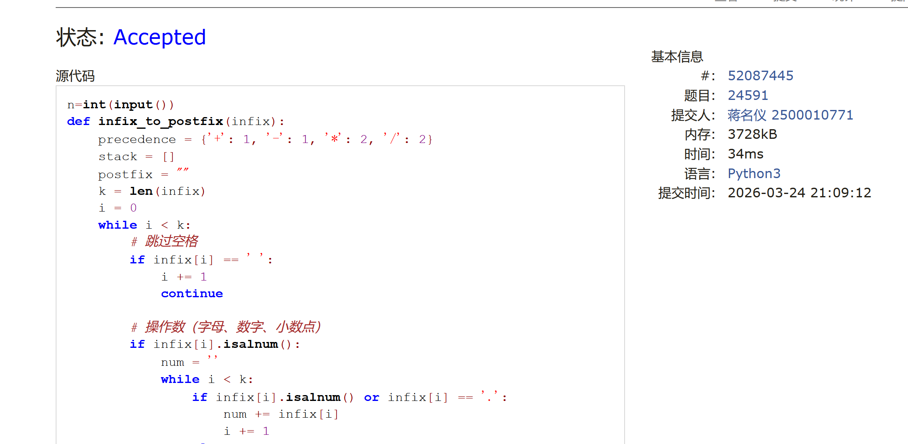
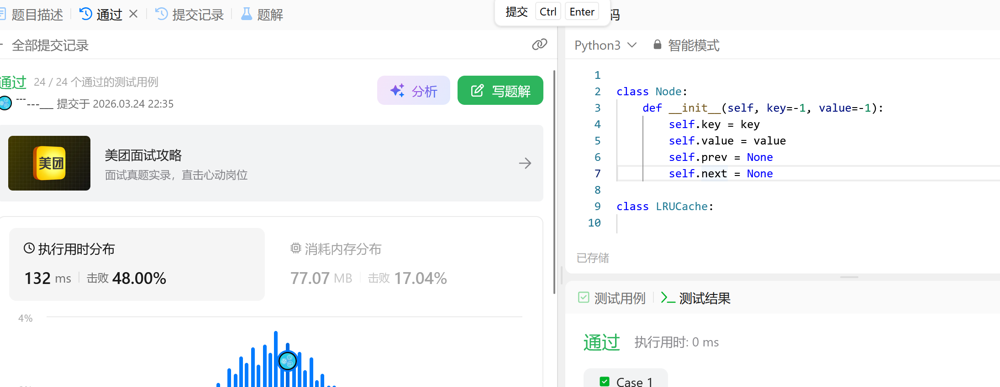
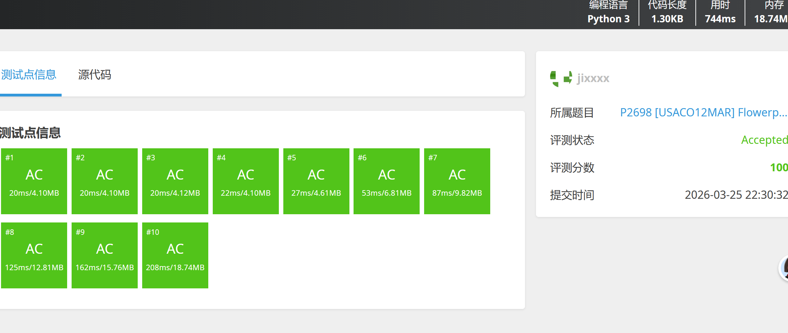

# DSA Assignment #4: 线性结构

*Updated 2026-03-23 22:22 GMT+8*
 *Compiled by <mark>同学的姓名、院系</mark> (2026 Spring)*


>**说明：**
>
>1. **解题与记录：**
>
>     对于每一个题目，请提供其解题思路（可选），并附上使用Python或C++编写的源代码（确保已在OpenJudge， Codeforces，LeetCode等平台上获得Accepted）。请将这些信息连同显示“Accepted”的截图一起填写到下方的作业模板中。（推荐使用Typora https://typoraio.cn 进行编辑，当然你也可以选择Word。）无论题目是否已通过，请标明每个题目大致花费的时间。
>
>2. **提交安排：**提交时，请首先上传PDF格式的文件，并将.md或.doc格式的文件作为附件上传至右侧的“作业评论”区。确保你的Canvas账户有一个清晰可见的本人头像，提交的文件为PDF格式，并且“作业评论”区包含上传的.md或.doc附件。
> 
>3. **延迟提交：**如果你预计无法在截止日期前提交作业，请提前告知具体原因。这有助于我们了解情况并可能为你提供适当的延期或其他帮助。  
>
>请按照上述指导认真准备和提交作业，以保证顺利完成课程要求。


## 1. 题目

### E160.相交链表

hash table, linked list, two pinters, https://leetcode.cn/problems/intersection-of-two-linked-lists/

思路：

集合

代码：

```python
class Solution:
    def getIntersectionNode(self, headA: ListNode, headB: ListNode) -> Optional[ListNode]:
        if headA==headB:
            return headA
        visited=set()
        visited.add(headA)
        visited.add(headB)
        curA=headA.next
        curB=headB.next
        while curA or curB:
            if curA:
                if curA in visited:
                    return curA
                else:
                    visited.add(curA)
                curA=curA.next

            if curB :
                if curB in visited:
                    return curB
                else:
                    visited.add(curB)
                curB=curB.next
        return
```


代码运行截图 <mark>（至少包含有"Accepted"）</mark>



### E206.反转链表

recursion, linked list, https://leetcode.cn/problems/reverse-linked-list/


思路：

遍历

代码：

```python
class Solution:
    def reverseList(self, head: Optional[ListNode]) -> Optional[ListNode]:
        if head == None:
            return
        if  head.next == None:
            return head
        cur=head.next
        pre=head
        head.next=None
        while cur:
            nxt=cur.next
            cur.next=pre
            pre=cur
            cur=nxt
        return pre
```


代码运行截图 <mark>（至少包含有"Accepted"）</mark>


### M234.回文链表

linked list, two pointers, https://leetcode.cn/problems/palindrome-linked-list/

<mark>请用快慢指针实现</mark> `O(1)` 空间复杂度。

思路：

快慢指针

代码：

```python
class Solution:
    def isPalindrome(self, head: Optional[ListNode]) -> bool:
        slow=head
        pre=None
        fast=head
        while fast:
            if fast.next and fast.next.next:
                fast=fast.next.next
                nxt=slow.next
                slow.next=pre
                pre=slow
                slow=nxt
            elif fast.next:
                fast=fast.next
                nxt=slow.next
                slow.next=pre
                pre=slow
                slow=nxt
                while pre and slow:
                    if pre.val!=slow.val:
                        return False
                    pre=pre.next
                    slow=slow.next
                return True
            else:
                nx=slow.next
                while pre and nx:
                    if pre.val!=nx.val:
                        return False
                    pre=pre.next
                    nx=nx.next
                return True
```


代码运行截图 <mark>（至少包含有"Accepted"）</mark>



### M24591:中序表达式转后序表达式

stack, http://cs101.openjudge.cn/practice/24591/

思路：
感觉第一次做还是会有点绕，核心就是注意可以每次遇到数字就入栈，遇到右括号就出栈，然后将运算符和数字压入栈，最后再将栈中的元素出栈，组成后序表达式。


代码：

```python
n=int(input())
def infix_to_postfix(infix):
    precedence = {'+': 1, '-': 1, '*': 2, '/': 2}
    stack = []
    postfix = ""
    k = len(infix)
    i = 0
    while i < k:
        # 跳过空格
        if infix[i] == ' ':
            i += 1
            continue

        # 操作数（字母、数字、小数点）
        if infix[i].isalnum():
            num = ''
            while i < k:
                if infix[i].isalnum() or infix[i] == '.':
                    num += infix[i]
                    i += 1
                else:
                    break          # 遇到运算符或括号，停止读取操作数
            postfix += num + ' '

        # 运算符
        elif infix[i] in '+-*/':
            while stack and stack[-1] != '(' and precedence[infix[i]] <= precedence[stack[-1]]:
                postfix += stack.pop() + ' '
            stack.append(infix[i])
            i += 1

        # 左括号
        elif infix[i] == '(':
            stack.append(infix[i])
            i += 1

        # 右括号
        elif infix[i] == ')':
            while stack and stack[-1] != '(':
                postfix += stack.pop() + ' '
            stack.pop()   # 弹出 '('
            i += 1

        # 其他字符（如制表符），跳过
        else:
            i += 1

    # 弹出栈中剩余运算符
    while stack:
        postfix += stack.pop() + ' '

    return postfix
for i in range(n):
    infix=input()
    postfix=infix_to_postfix(infix)
    print(postfix)
```


代码运行截图 <mark>（至少包含有"Accepted"）</mark>


### M146.LRU缓存

hash table, doubly-linked list, https://leetcode.cn/problems/lru-cache/

思路：

双向链表实现小时间操作

代码

```python
class Node:
    def __init__(self,key=-1,value=-1):
        self.key=key
        self.value=value
        self.prev=None
        self.next=None
class LRUCache:

    def __init__(self, capacity: int):
        self.cache={}
        self.head=Node()
        self.tail=Node()
        self.head.next=self.tail
        self.tail.prev=self.head
        self.capacity=capacity
        self.size=0


    def get(self, key: int) -> int:
        if key not in self.cache:
            return -1
        node=self.cache[key]
        pre=node.prev
        nex=node.next
        pre.next=nex
        nex.prev=pre
        self.head.next=node
        node.next=None
        node.prev=self.head
        self.head=node


    def put(self, key: int, value: int) -> None: 
        if key in self.cache:
            self.cache[key].value=value
        else:
            if self.size ==self.capacity:
                self.tail=self.tail.next
                self.tail.prev=None
                self.size-=1

            self.size+=1
            node=Node(key,value)  
            self.head.next=node
            node.next=None
            node.prev=self.head
            self.head=node
```


<mark>（至少包含有"Accepted"）</mark>


### P2698 [USACO12MAR] Flowerpot S

monotonic queue, https://www.luogu.com.cn/problem/P2698

思路：单调栈，用两个单调栈加上一些滑动窗口的应用


代码

```python
from collections import deque
import sys

def solve():
    input = sys.stdin.readline
    n, d = map(int, input().split())
    points = []
    for _ in range(n):
        x, y = map(int, input().split())
        points.append((x, y))
    
    # 按 x 排序
    points.sort(key=lambda p: p[0])
    
    # 单调队列：max_q 存储 (y, index) 按 y 递减，min_q 按 y 递增
    max_q = deque()   # 队首是最大值
    min_q = deque()   # 队首是最小值
    ans = float('inf')
    left = 0
    
    for right in range(n):
        x_r, y_r = points[right]
        # 将新点加入两个队列
        while max_q and max_q[-1][0] <= y_r:
            max_q.pop()
        max_q.append((y_r, right))
        
        while min_q and min_q[-1][0] >= y_r:
            min_q.pop()
        min_q.append((y_r, right))
        
        # 当区间内极差 >= d 时，尝试缩小左边界
        while max_q and min_q and max_q[0][0] - min_q[0][0] >= d:
            # 当前区间宽度 = x_r - x_left
            x_left = points[left][0]
            ans = min(ans, x_r - x_left)
            # 移动左指针
            left += 1
            # 清理队列中已经滑出窗口的元素
            while max_q and max_q[0][1] < left:
                max_q.popleft()
            while min_q and min_q[0][1] < left:
                min_q.popleft()
    
    if ans == float('inf'):
        print(-1)   # 没有符合条件的区间
    else:
        print(ans)

if __name__ == "__main__":
    solve()
```


<mark>（至少包含有"Accepted"）</mark>



## 2. 学习总结和个人收获

<mark>如果发现作业题目相对简单，有否寻找额外的练习题目，如“数算2026spring每日选做”、LeetCode、Codeforces、洛谷等网站上的题目。</mark>
本周题目总体不难，尤其最后一题比前面的几周的最后一题简单的多，但是这种内容很多，虽然很多在计概上面就训练过了，但是还是需要多多练习巩固


