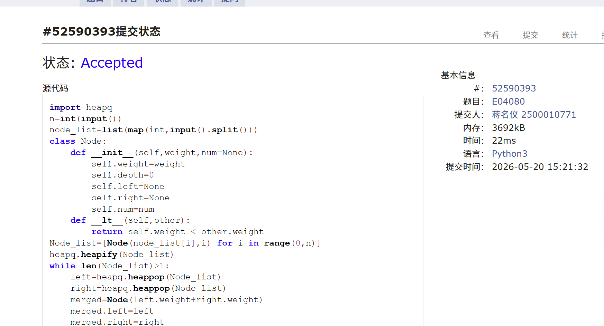
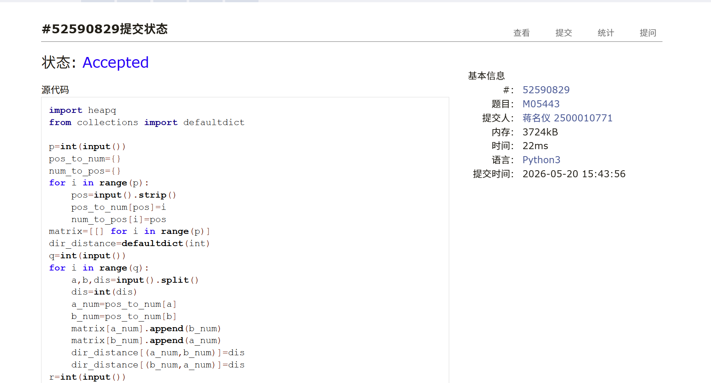
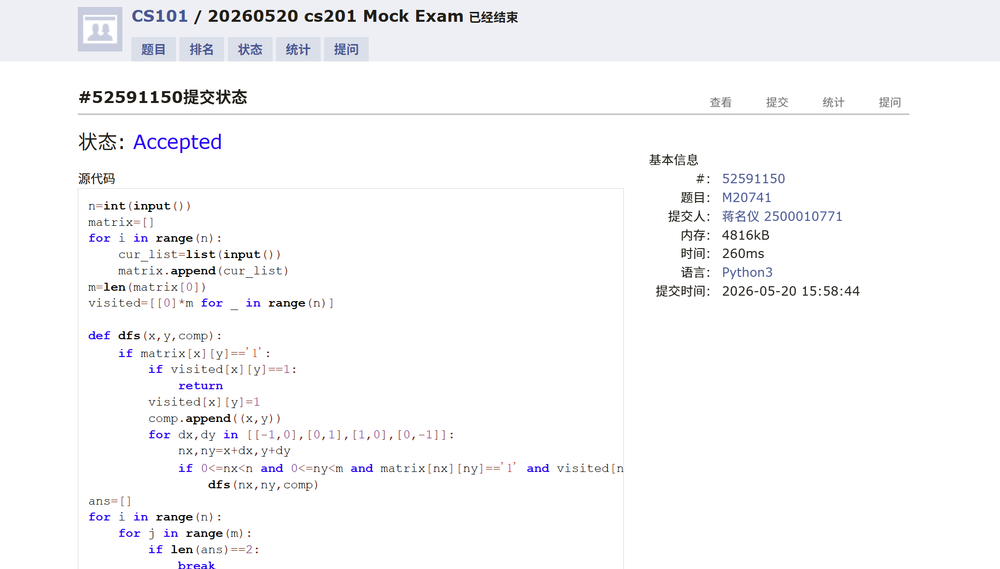
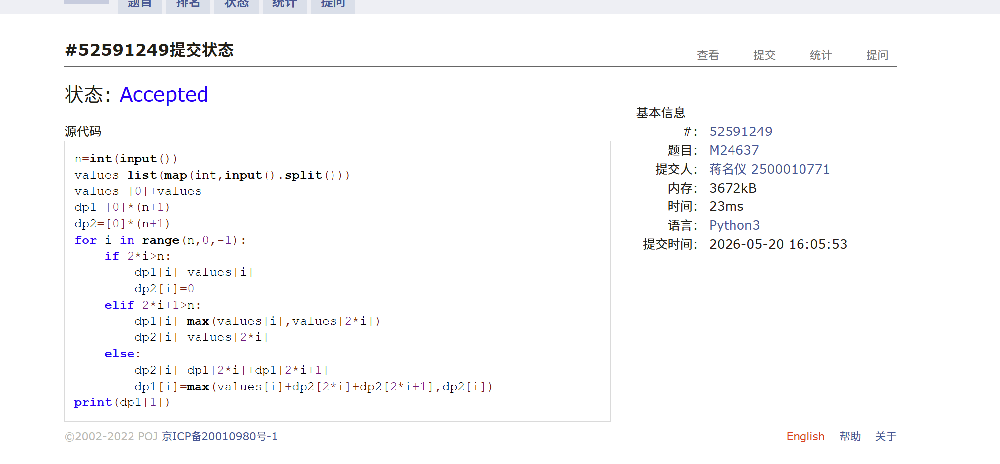
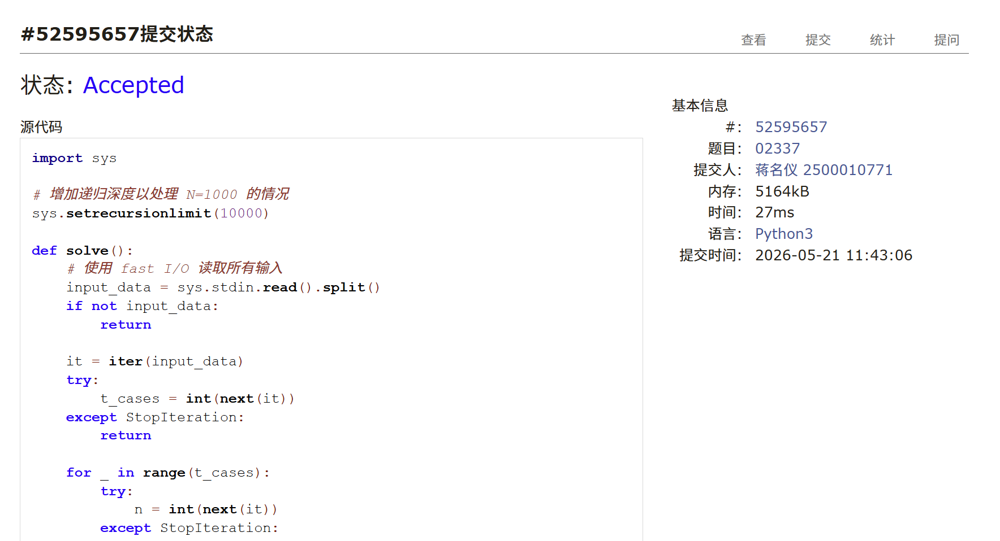
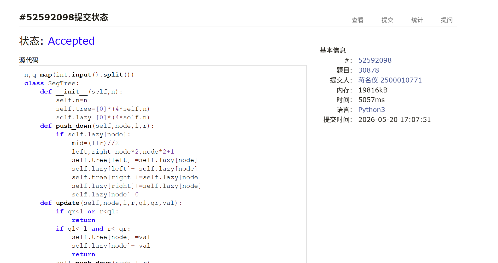

# DSA Assignment 520: 20260520模拟考

*Updated 2026-05-20 16:47 GMT+8*
 *Compiled by <mark>蒋名仪 2500010771</mark> (2026 Spring)*


>**说明：**
>
>1. **解题与记录：**
>
>     对于每一个题目，请提供其解题思路（可选），并附上使用Python或C++编写的源代码（确保已在OpenJudge， Codeforces，LeetCode等平台上获得Accepted）。请将这些信息连同显示“Accepted”的截图一起填写到下方的作业模板中。（推荐使用Typora https://typoraio.cn 进行编辑，当然你也可以选择Word。）无论题目是否已通过，请标明每个题目大致花费的时间。
>
>2. **提交安排：**提交时，请首先上传PDF格式的文件，并将.md或.doc格式的文件作为附件上传至右侧的“作业评论”区。确保你的Canvas账户有一个清晰可见的本人头像，提交的文件为PDF格式，并且“作业评论”区包含上传的.md或.doc附件。
> 
>3. **延迟提交：**如果你预计无法在截止日期前提交作业，请提前告知具体原因。这有助于我们了解情况并可能为你提供适当的延期或其他帮助。  
>
>请按照上述指导认真准备和提交作业，以保证顺利完成课程要求。


## 1. 题目

### E04080: Huffman编码树

http://cs101.openjudge.cn/practice/04080/

思路：
huffman编码纯抄写


代码：

```python
import heapq
n=int(input())
node_list=list(map(int,input().split()))
class Node:
    def __init__(self,weight,num=None):
        self.weight=weight
        self.depth=0
        self.left=None
        self.right=None
        self.num=num
    def __lt__(self,other):
        return self.weight < other.weight
Node_list=[Node(node_list[i],i) for i in range(0,n)]
heapq.heapify(Node_list)
while len(Node_list)>1:
    left=heapq.heappop(Node_list)
    right=heapq.heappop(Node_list)
    merged=Node(left.weight+right.weight)
    merged.left=left
    merged.right=right
    heapq.heappush(Node_list,merged)
roott=Node_list[0]
ans=[0]
def dfs(root):
    if root.num!=None:
        ans[0]+=root.depth*root.weight
        return
    root.left.depth=root.depth+1
    dfs(root.left)
    root.right.depth=root.depth+1
    dfs(root.right)
dfs(roott)
print(ans[0])
```


代码运行截图 <mark>（至少包含有"Accepted"）</mark>



### M05443: 兔子与樱花

dijkstra, Floyd-Warshall, http://cs101.openjudge.cn/practice/05443/


思路：
dijkstra算法。


代码：

```python
import heapq
from collections import defaultdict

p=int(input())
pos_to_num={}
num_to_pos={}
for i in range(p):
    pos=input().strip()
    pos_to_num[pos]=i
    num_to_pos[i]=pos
matrix=[[] for i in range(p)]
dir_distance=defaultdict(int)
q=int(input())
for i in range(q):
    a,b,dis=input().split()
    dis=int(dis)
    a_num=pos_to_num[a]
    b_num=pos_to_num[b]
    matrix[a_num].append(b_num)
    matrix[b_num].append(a_num)
    dir_distance[(a_num,b_num)]=dis
    dir_distance[(b_num,a_num)]=dis
r=int(input())
for i in range(r):
    start,end=input().split()
    s_num=pos_to_num[start]
    e_num=pos_to_num[end]
    distance=[float('inf')]*(p)
    distance[s_num]=0
    stack=[]
    heapq.heappush(stack,(0,s_num,-1))
    pre=[-1]*(p)
    while stack:
        di,pos,prev=heapq.heappop(stack)
        if di>distance[pos]:
            continue
        pre[pos]=prev
        distance[pos]=di
        if pos==e_num:
            break
        for next_pos in matrix[pos]:
            if  di+dir_distance[(pos,next_pos)]<distance[next_pos]:
                distance[next_pos]=di+dir_distance[(pos,next_pos)]
                heapq.heappush(stack,(di+dir_distance[(pos,next_pos)],next_pos,pos))
    path=[]
    en=e_num
    while en!=-1:
        path.append(en)
        en=pre[en]
    if len(path)==1:
        print(num_to_pos[path[0]])
    else:
        path=path[::-1]
        for i in range(len(path)-1):
            print(f'{num_to_pos[path[i]]}->({dir_distance[(path[i],path[i+1])]})->',end='')
        print(f'{num_to_pos[path[-1]]}')
```


代码运行截图 <mark>（至少包含有"Accepted"）</mark>



### M20741: 两座孤岛最短距离

bfs, http://cs101.openjudge.cn/practice/20741/

思路：
用bfs求？我是直接遍历了（


代码：

```python
n=int(input())
matrix=[]
for i in range(n):
    cur_list=list(input())
    matrix.append(cur_list)
m=len(matrix[0])
visited=[[0]*m for _ in range(n)]

def dfs(x,y,comp):
    if matrix[x][y]=='1':
        if visited[x][y]==1:
            return
        visited[x][y]=1
        comp.append((x,y))
        for dx,dy in [[-1,0],[0,1],[1,0],[0,-1]]:
            nx,ny=x+dx,y+dy
            if 0<=nx<n and 0<=ny<m and matrix[nx][ny]=='1' and visited[nx][ny]==0:
                dfs(nx,ny,comp)
ans=[]
for i in range(n):
    for j in range(m):
        if len(ans)==2:
            break
        if visited[i][j]==0 and matrix[i][j]=='1':
            comp=[]
            dfs(i,j,comp)
            ans.append(comp)
final=float('inf')
for x1,y1 in ans[0]:
    for x2,y2 in ans[1]:
        if abs(x1-x2)+abs(y1-y2)<final:
            final=abs(x1-x2)+abs(y1-y2)
print(final-1)
```


代码运行截图 <mark>（至少包含有"Accepted"）</mark>



### M24637: 宝藏二叉树

dp, dfs http://cs101.openjudge.cn/practice/24637/

思路：
树形dp


代码：

```python
n=int(input())
values=list(map(int,input().split()))
values=[0]+values
dp1=[0]*(n+1)
dp2=[0]*(n+1)
for i in range(n,0,-1):
    if 2*i>n:
        dp1[i]=values[i]
        dp2[i]=0
    elif 2*i+1>n:
        dp1[i]=max(values[i],values[2*i])
        dp2[i]=values[2*i]
    else:
        dp2[i]=dp1[2*i]+dp1[2*i+1]
        dp1[i]=max(values[i]+dp2[2*i]+dp2[2*i+1],dp2[i])
print(dp1[1])
```


代码运行截图 <mark>（至少包含有"Accepted"）</mark>



### T02337: Catenyms

Eulerian Path, http://cs101.openjudge.cn/practice/02337/

思路：
欧拉路径问题，代码来自题解。核心就是1.通过出入度和连通性可以判断是否能一次走完。2.Hierholzer 算法可以找到字典序最小的欧拉路径。这主要是每次遍历都保证了其仍然符合能走完，且走到尽头只能说明到了另一个头，反转回来原来的头寻路即可，但是这样就需要逆序讲经过节点压入栈让第一次遍历的开头和第二次的结尾相吻合。


代码

```python
import sys

# 增加递归深度以处理 N=1000 的情况
sys.setrecursionlimit(10000)

def solve():
    # 使用 fast I/O 读取所有输入
    input_data = sys.stdin.read().split()
    if not input_data:
        return
    
    it = iter(input_data)
    try:
        t_cases = int(next(it))
    except StopIteration:
        return
    
    for _ in range(t_cases):
        try:
            n = int(next(it))
        except StopIteration:
            break
        
        words = []
        for _ in range(n):
            words.append(next(it))
        
        # 1. 字典序排序
        # 我们希望在 DFS 中先走字典序小的边。
        # 配合 pop()，我们将单词按降序排列，这样 pop() 拿到的就是最小的单词。
        words.sort(reverse=True)
        
        adj = [[] for _ in range(26)]
        in_deg = [0] * 26
        out_deg = [0] * 26
        chars_present = [False] * 26
        
        for w in words:
            u = ord(w[0]) - ord('a')
            v = ord(w[-1]) - ord('a')
            adj[u].append(w)
            out_deg[u] += 1
            in_deg[v] += 1
            chars_present[u] = chars_present[v] = True
            
        # 2. 查找起点并检查度数条件
        start_node = -1
        out_minus_in_1 = 0
        in_minus_out_1 = 0
        possible = True
        
        for i in range(26):
            diff = out_deg[i] - in_deg[i]
            if diff == 1:
                out_minus_in_1 += 1
                start_node = i
            elif diff == -1:
                in_minus_out_1 += 1
            elif diff == 0:
                continue
            else:
                possible = False
                break
        
        # 欧拉通路判别
        if not ((out_minus_in_1 == 0 and in_minus_out_1 == 0) or 
                (out_minus_in_1 == 1 and in_minus_out_1 == 1)):
            possible = False

        if not possible:
            print("***")
            continue

        # 如果是欧拉回路，从最小的具有出度的字符开始
        if start_node == -1:
            for i in range(26):
                if out_deg[i] > 0:
                    start_node = i
                    break
        
        # 3. Hierholzer 算法寻找路径
        res_path = []
        
        def dfs(u):
            curr_adj = adj[u]
            while curr_adj:
                # 弹出当前节点最小的单词（因为之前是 reverse 排序）
                w = curr_adj.pop()
                v = ord(w[-1]) - ord('a')
                dfs(v)
                # 后序加入路径
                res_path.append(w)
        
        if start_node != -1:
            dfs(start_node)
        
        # 4. 连通性检查及输出
        if len(res_path) != n:
            print("***")
        else:
            # 路径是后序添加的，需要反转
            print(".".join(reversed(res_path)))

if __name__ == "__main__":
    solve()
```


<mark>（至少包含有"Accepted"）</mark>



### T30878:力场叠加模拟

segment tree, lazy propagation, http://cs101.openjudge.cn/practice/30878/

思路：
线段树+懒删除，模板题


代码

```python
n,q=map(int,input().split())
class SegTree:
    def __init__(self,n):
        self.n=n
        self.tree=[0]*(4*self.n)
        self.lazy=[0]*(4*self.n)
    def push_down(self,node,l,r):
        if self.lazy[node]:
            mid=(l+r)//2
            left,right=node*2,node*2+1
            self.tree[left]+=self.lazy[node]
            self.lazy[left]+=self.lazy[node]
            self.tree[right]+=self.lazy[node]
            self.lazy[right]+=self.lazy[node]
            self.lazy[node]=0
    def update(self,node,l,r,ql,qr,val):
        if qr<l or r<ql:
            return
        if ql<=l and r<=qr:
            self.tree[node]+=val
            self.lazy[node]+=val
            return
        self.push_down(node,l,r)
        mid=(l+r)//2
        self.update(node*2,l,mid,ql,qr,val)
        self.update(node*2+1,mid+1,r,ql,qr,val)
        self.tree[node]=max(self.tree[node*2],self.tree[node*2+1])

    def query(self,node ,l,r,ql,qr):
        if qr<l or r<ql:
            return float('-inf')
        if ql<=l and r<=qr:
            return self.tree[node]
        self.push_down(node,l,r)
        mid=(l+r)//2
        return max(self.query(node*2,l,mid,ql,qr),self.query(node*2+1,mid+1,r,ql,qr))
st=SegTree(n)
for i in range(q):
    actions=input().split()
    if actions[0]=='Add':
        a=int(actions[1])
        b=int(actions[2])
        val=int(actions[3])
        st.update(1,0,st.n-1,a-1,b-1,val)
    elif actions[0]=='Query':
        a=int(actions[1])
        b=int(actions[2])
        print(st.query(1,0,st.n-1,a-1,b-1))
```


<mark>（至少包含有"Accepted"）</mark>



## 2. 学习总结和个人收获

<mark>如果发现作业题目相对简单，有否寻找额外的练习题目，如“数算2026spring每日选做”、LeetCode、Codeforces、洛谷等网站上的题目。</mark>
这次考试我用了cheat sheet,感觉前四题虽然会做但是看着cheat sheet总是会安心很多，，然后做最后两题还剩50 min 那样但是第五题只知道怎么判断联通不清楚怎么输出最小字典序，纠结很久还剩十几分钟发现最后一题模板题（而且cheat sheet 上还有），就是没来得及做完有点可惜。


