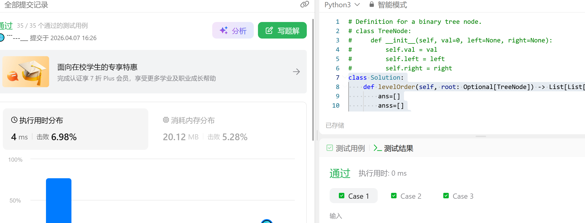
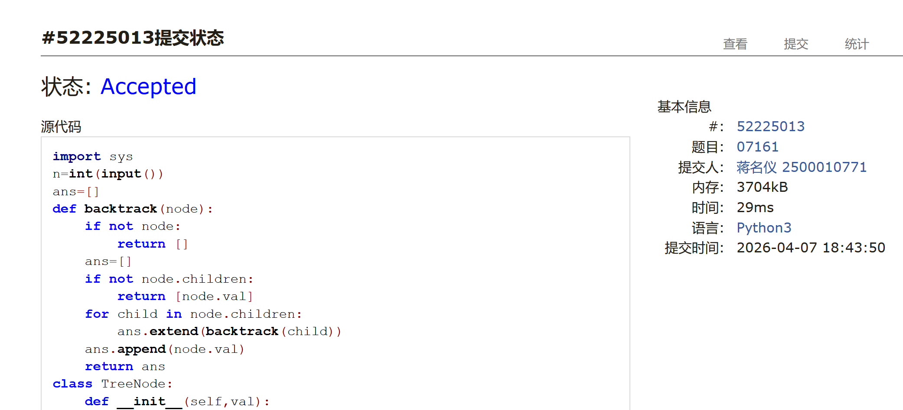
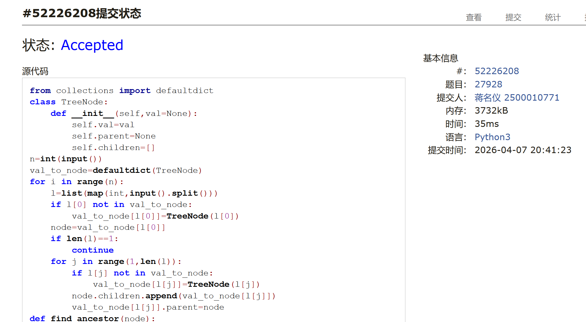

# DSA Assignment #6: 🌲（1/3）

*Updated 2026-04-05 21:54 GMT+8*
 *Compiled by 蒋名仪 (2026 Spring)*


>**说明：**
>
>1. **解题与记录：**
>
>     对于每一个题目，请提供其解题思路（可选），并附上使用Python或C++编写的源代码（确保已在OpenJudge， Codeforces，LeetCode等平台上获得Accepted）。请将这些信息连同显示“Accepted”的截图一起填写到下方的作业模板中。（推荐使用Typora https://typoraio.cn 进行编辑，当然你也可以选择Word。）无论题目是否已通过，请标明每个题目大致花费的时间。
>
>2. **提交安排：**提交时，请首先上传PDF格式的文件，并将.md或.doc格式的文件作为附件上传至右侧的“作业评论”区。确保你的Canvas账户有一个清晰可见的本人头像，提交的文件为PDF格式，并且“作业评论”区包含上传的.md或.doc附件。
> 
>3. **延迟提交：**如果你预计无法在截止日期前提交作业，请提前告知具体原因。这有助于我们了解情况并可能为你提供适当的延期或其他帮助。  
>
>请按照上述指导认真准备和提交作业，以保证顺利完成课程要求。


## 1. 题目

### E94.二叉树的中序遍历

dfs, stack, https://leetcode.cn/problems/binary-tree-inorder-traversal/

思路：
递归


代码：

```python
class Solution:
    def inorderTraversal(self, root: Optional[TreeNode]) -> List[int]:
        if root:
            ans=[]
            ans.extend(self.inorderTraversal(root.left))
            ans.append(root.val)
            ans.extend(self.inorderTraversal(root.right))
            return ans
        else:
            return []
```


代码运行截图 <mark>（至少包含有"Accepted"）</mark>


### E108.将有序数组转换为二叉搜索树

https://leetcode.cn/problems/convert-sorted-array-to-binary-search-tree/


思路：

还是递归

代码：

```python
class Solution:
    def sortedArrayToBST(self, nums: List[int]) -> Optional[TreeNode]:
        if nums==[]:
            return None
        mid=len(nums)//2
        left_li=self.sortedArrayToBST(nums[:mid])
        right_li=self.sortedArrayToBST(nums[(mid+1):])
        node=TreeNode(nums[mid])
        node.left=left_li
        node.right=right_li
        return node
```


代码运行截图 <mark>（至少包含有"Accepted"）</mark>


### M102.二叉树的层序遍历

bfs, https://leetcode.cn/problems/binary-tree-level-order-traversal/

思路：
先把父辈的节点压进去，再取出来看看是不是有子节点


代码：

```python
class Solution:
    def levelOrder(self, root: Optional[TreeNode]) -> List[List[int]]:
        ans=[]
        anss=[]
        if root:
            ans.append([root])
            anss.append([root.val])
        else:
            return []
        while ans[-1]!=[]:
            a=[]
            b=[]
            for i in ans[-1]:
                if i.left:
                    a.append(i.left)
                    b.append(i.left.val)
                if i.right:
                    a.append(i.right)
                    b.append(i.right.val)
            ans.append(a)
            anss.append(b)
        if anss[-1]==[]:
            anss.pop()
        
        return anss
```


代码运行截图 <mark>（至少包含有"Accepted"）</mark>



### M1123.最深叶节点的最近公共祖先

dfs, https://leetcode.cn/problems/lowest-common-ancestor-of-deepest-leaves/

思路：
利用一下第三题，得到最后一层，同时遍历的时候记录每个节点的父节点，再一层一层往上跑


代码：

```python
class Solution:
    def lcaDeepestLeaves(self, root: Optional[TreeNode]) -> Optional[TreeNode]:
        dic={}
        li=[]
        if root:
            li.append([root])
        else:
            return None
        while li[-1]!=[]:
            a=[]
            for i in li[-1]:
                if i.left:
                    a.append(i.left)
                    dic[i.left]=i
                if i.right:
                    a.append(i.right)
                    dic[i.right]=i
            li.append(a)
        li.pop()
        queue=li[-1]
        while len(queue)>1:
            a=set()
            for i in queue:
                a.add(dic[i])
            queue=a
        return list(queue)[0]
```


代码运行截图 <mark>（至少包含有"Accepted"）</mark>


### M07161: 森林的带度数层次序列存储

tree, http://cs101.openjudge.cn/practice/07161/

思路：

建树+后序遍历

代码

```python
import sys
n=int(input())
ans=[]
def backtrack(node):
    if not node:
        return []
    ans=[]
    if not node.children:
        return [node.val]
    for child in node.children:
        ans.extend(backtrack(child))
    ans.append(node.val)
    return ans
class TreeNode:
    def __init__(self,val):
        self.val=val
        self.children=[]
for r in range(n):
    s=sys.stdin.readline().strip().split()
    stack=[]
    cur_ans=[]
    i=0
    stack.append((b:=TreeNode(s[i]),s[i+1]))
    start=b
    i+=1
    while stack:
        cur_ans.append(stack)
        sa=[]
        for k,j in stack:
            if int(j)>0:
                for l in range(int(j)):
                    i+=1
                    sa.append((c:=TreeNode(s[i]),s[i+1]))
                    k.children.append(c)
                    i+=1
        stack=sa
    ans.extend(backtrack(start))
print(' '.join(ans))
```


<mark>（至少包含有"Accepted"）</mark>




### M27928: 遍历树

 adjacency list, dfs, http://cs101.openjudge.cn/practice/27928/

思路：
呃呃没看出dfs在哪里，，我的做法反正还是递归，这题和第五题的区别就是一个要建树一个要排序


代码

```python
from collections import defaultdict
class TreeNode:
    def __init__(self,val=None):
        self.val=val
        self.parent=None
        self.children=[]
n=int(input())
val_to_node=defaultdict(TreeNode)
for i in range(n):
    l=list(map(int,input().split()))
    if l[0] not in val_to_node:
        val_to_node[l[0]]=TreeNode(l[0])
    node=val_to_node[l[0]]
    if len(l)==1:
        continue
    for j in range(1,len(l)):
        if l[j] not in val_to_node:
            val_to_node[l[j]]=TreeNode(l[j])
        node.children.append(val_to_node[l[j]])
        val_to_node[l[j]].parent=node
def find_ancestor(node):
    if node.parent is None:
        return node
    return find_ancestor(node.parent)
start=find_ancestor(val_to_node[l[0]])
def small_to_large_sort(node):
    if not node.children:
        return [node.val]
    ans=[]
    l=[]
    l.extend(node.children)
    l.append(node)
    l.sort(key=lambda x: x.val)
    for no in l:
        if no.val==node.val:
            ans.append(no.val)
        else:
            ans.extend(small_to_large_sort(no))
    return ans
print('\n'.join(map(str,small_to_large_sort(start))))
```


<mark>（至少包含有"Accepted"）</mark>



## 2. 学习总结和个人收获

<mark>如果发现作业题目相对简单，有否寻找额外的练习题目，如“数算2026spring每日选做”、LeetCode、Codeforces、洛谷等网站上的题目。</mark>

这周新学树，感觉就是一个显式的递归没什么好说的
但是作业中提到了dfs，我觉得我一直以来关于dfs的运用都不够熟练，比如全排序、八皇后等题不太能一下子写出来，所以回去多练了一下，这周的作业也算是加深了我的理解。


