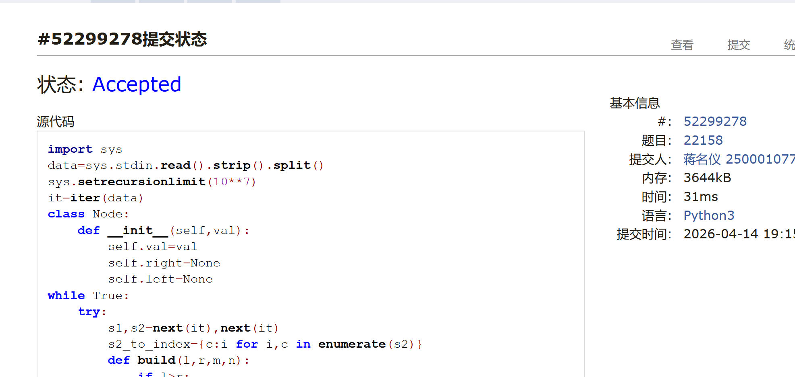
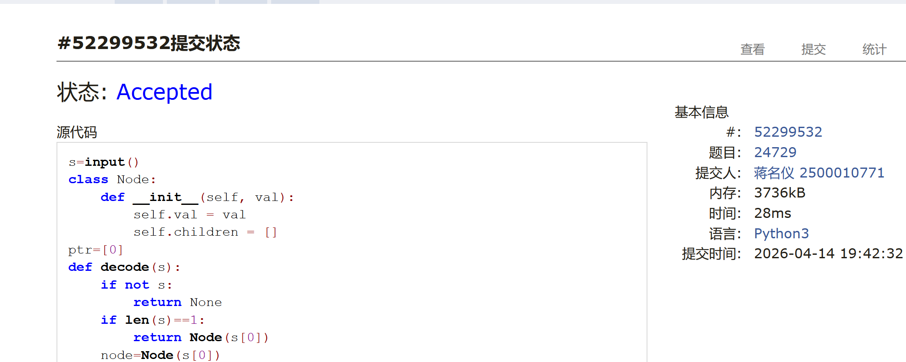
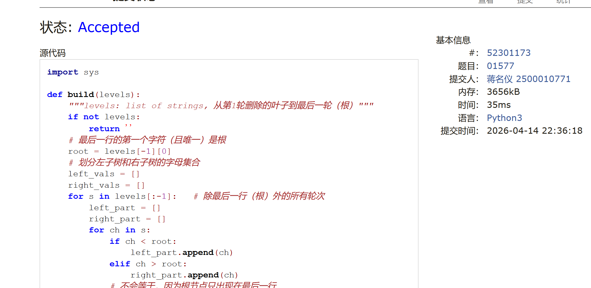
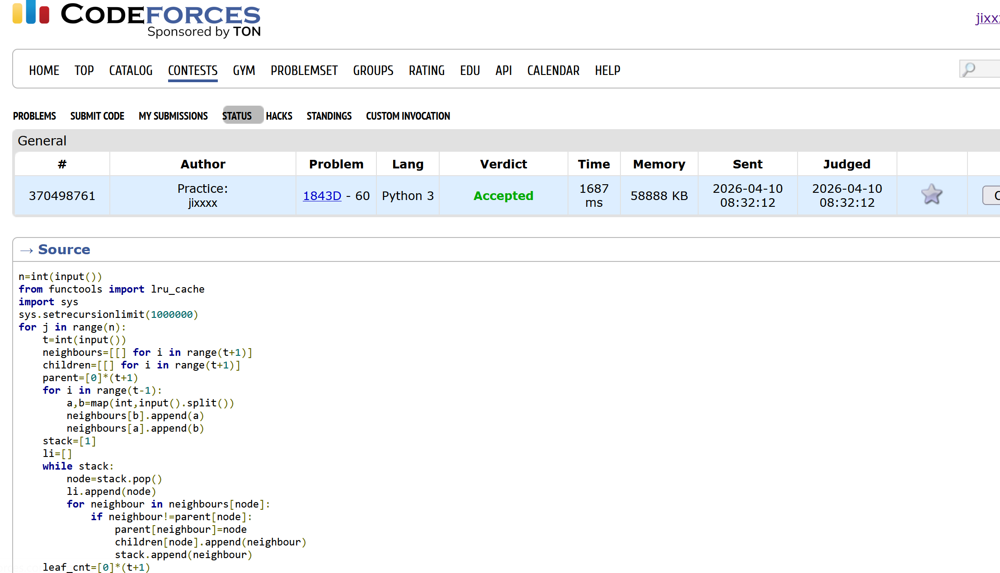

# DSA Assignment #7: 🌲（2/3）

*Updated 2026-04-09 15:45 GMT+8*
 *Compiled by <mark>蒋名仪-2500010771</mark> (2026 Spring)
>**说明：**
>
>1. **解题与记录：**
>
>     对于每一个题目，请提供其解题思路（可选），并附上使用Python或C++编写的源代码（确保已在OpenJudge， Codeforces，LeetCode等平台上获得Accepted）。请将这些信息连同显示“Accepted”的截图一起填写到下方的作业模板中。（推荐使用Typora https://typoraio.cn 进行编辑，当然你也可以选择Word。）无论题目是否已通过，请标明每个题目大致花费的时间。
>
>2. **提交安排：**提交时，请首先上传PDF格式的文件，并将.md或.doc格式的文件作为附件上传至右侧的“作业评论”区。确保你的Canvas账户有一个清晰可见的本人头像，提交的文件为PDF格式，并且“作业评论”区包含上传的.md或.doc附件。
> 
>3. **延迟提交：**如果你预计无法在截止日期前提交作业，请提前告知具体原因。这有助于我们了解情况并可能为你提供适当的延期或其他帮助。  
>
>请按照上述指导认真准备和提交作业，以保证顺利完成课程要求。


## 1. 题目

### M297.二叉树的序列化与反序列化

dfs, bfs, https://leetcode.cn/problems/serialize-and-deserialize-binary-tree/

思路：
层序遍历，但是保留为None的子节点。


代码：

```python
# Definition for a binary tree node.

class Codec:

    def serialize(self, root):
        """Encodes a tree to a single string.
        
        :type root: TreeNode
        :rtype: str
        """
        # 边界：根节点为空
        if not root:
            return "None"
        queue = deque([root])
        ans = []
        while queue:
            node = queue.popleft()
            if node:
                ans.append(str(node.val))
                queue.append(node.left)
                queue.append(node.right)
            else:
                ans.append("None")
        return ' '.join(ans)

    def deserialize(self, data):
        """Decodes your encoded data to tree.
        
        :type data: str
        :rtype: TreeNode
        """
        vals = data.split()
        idx = 0
        # 空树直接返回
        if vals[idx] == "None":
            return None
        
        # 初始化根节点，转整型！
        root = TreeNode(int(vals[idx]))
        idx += 1
        queue = deque([root])
        
        # 标准层序反序列化：取父节点 → 赋值左孩子 → 赋值右孩子
        while queue:
            parent = queue.popleft()
            
            # 左子节点
            if vals[idx] != "None":
                parent.left = TreeNode(int(vals[idx]))
                queue.append(parent.left)
            idx += 1
            
            # 右子节点
            if vals[idx] != "None":
                parent.right = TreeNode(int(vals[idx]))
                queue.append(parent.right)
            idx += 1
            
        return root
```


代码运行截图 <mark>（至少包含有"Accepted"）</mark>


### M129.求根节点到叶节点数字之和

dfs, https://leetcode.cn/problems/sum-root-to-leaf-numbers/


思路：

类似全排列的dfs,每次dfs到底部就把答案加进去

代码：

```python
class Solution:
    def sumNumbers(self, root: Optional[TreeNode]) -> int:
        ans=[0]
        dic={}
        def dfs(node,val):
            cur_val=val*10+node.val
            if node.left==None and node.right==None:
                ans[0]+=cur_val
                return
            if node.left:
                dfs(node.left,cur_val)
            if node.right:
                dfs(node.right,cur_val)
        dfs(root,0)
        return ans[0]
```


代码运行截图 <mark>（至少包含有"Accepted"）</mark>


### M22158:根据二叉树前中序序列建树

tree, http://cs101.openjudge.cn/practice/22158/


思路：
用遍历来建树


代码：

```python
import sys
data=sys.stdin.read().strip().split()
sys.setrecursionlimit(10**7)
it=iter(data)
class Node:
    def __init__(self,val):
        self.val=val
        self.right=None
        self.left=None
while True:
    try:
        s1,s2=next(it),next(it)
        s2_to_index={c:i for i,c in enumerate(s2)}
        def build(l,r,m,n):
            if l>r:
                return None
            elif l==r:
                return Node(s1[l])
            node=Node(s1[l])
            index=s2_to_index[node.val]
            node.left=build(l+1,l+index-m,m,index-1)
            node.right=build(l+index-m+1,r,index+1,n)
            return node
        root=build(0,len(s1)-1,0,len(s2)-1)
        ans=[]
        def back(node):
            if node.left:
                back(node.left)
            if node.right:
                back(node.right)
            ans.append(node.val)
        back(root)
        print(''.join(ans))
    
    except StopIteration:
        break
```


代码运行截图 <mark>（至少包含有"Accepted"）</mark>




### M24729:括号嵌套树

dfs, stack, http://cs101.openjudge.cn/practice/24729/


思路：
半个递归+半个栈


代码：

```python

s=input()
class Node:
    def __init__(self, val):
        self.val = val
        self.children = []
ptr=[0]
def decode(s):
    if not s:
        return None
    if len(s)==1:
        return Node(s[0])
    node=Node(s[0])
    a=len(s)
    stack=[]
    ptr=2
    i=1
    while i<a:
        if s[i]=='(':
            stack.append('(')
        elif s[i]==')':
            stack.pop()
        if s[i]==',' and len(stack)==1:
            node.children.append(decode(s[ptr:i]))
            ptr=i+1
        if not stack:
            node.children.append(decode(s[ptr:i]))
        i+=1
    return node
def front(node):
    if not node:
        return ''
    if not node.children:
        return node.val   
    ans=[node.val]
    for child in node.children:
        ans.append(front(child))
    return ''.join(ans)
def inorder(node):
    if not node:
        return ''
    if not node.children:
        return node.val
    ans=[]
    for child in node.children:
        ans.append(inorder(child))
    ans.append(node.val)
    return ''.join(ans)
root=decode(s)
print(front(root))
print(inorder(root))
```


代码运行截图 <mark>（至少包含有"Accepted"）</mark>




### M01577: Falling Leaves

tree, http://cs101.openjudge.cn/practice/01577/


思路：
刚开始一直看错题了没做对，后面就一直想用栈硬写，事实证明实力不够的时候还是不要硬要用栈了。。最后是ds告诉我用递归写，我刚开始还想这种几行几行怎么用递归？后面发现几行几行你就每次递归都输进去几行就好了，唉。
代码

```python
import sys

def build(levels):
    """levels: list of strings, 从第1轮删除的叶子到最后一轮（根）"""
    if not levels:
        return ''
    # 最后一行的第一个字符（且唯一）是根
    root = levels[-1][0]
    # 划分左子树和右子树的字母集合
    left_vals = []
    right_vals = []
    for s in levels[:-1]:   # 除最后一行（根）外的所有轮次
        left_part = []
        right_part = []
        for ch in s:
            if ch < root:
                left_part.append(ch)
            elif ch > root:
                right_part.append(ch)
            # 不会等于，因为根节点只出现在最后一行
        if left_part:
            left_vals.append(''.join(left_part))
        if right_part:
            right_vals.append(''.join(right_part))
    # 递归构建左右子树
    left_pre = build(left_vals)   # left_vals 已是正确格式的 levels
    right_pre = build(right_vals)
    return root + left_pre + right_pre

def main():
    data = sys.stdin.read().strip().split()
    out_lines = []
    i = 0
    while i < len(data):
        levels = []
        while i < len(data) and data[i] not in ('*', '$'):
            levels.append(data[i])
            i += 1
        if not levels:   # 空行跳过
            if i < len(data):
                i += 1
            continue
        # 注意：levels[0] 是第一轮删除的叶子，levels[-1] 是根
        preorder = build(levels)
        out_lines.append(preorder)
        if i < len(data) and data[i] == '$':
            break
        i += 1   # 跳过 '*' 或 '$'
    sys.stdout.write('\n'.join(out_lines))

if __name__ == '__main__':
    main()
```


<mark>（至少包含有"Accepted"）</mark>




### 1843D. Apple Tree

 Combinatorics, dfs and similar, dp, math, trees, 1200,  https://codeforces.com/problemset/problem/1843/D

思路：
先前序遍历得到一个序列再倒着用这个dp即可


代码

```python
n=int(input())
from functools import lru_cache
import sys
sys.setrecursionlimit(1000000)
for j in range(n):
    t=int(input())
    neighbours=[[] for i in range(t+1)]
    children=[[] for i in range(t+1)]
    parent=[0]*(t+1)
    for i in range(t-1):
        a,b=map(int,input().split())
        neighbours[b].append(a)
        neighbours[a].append(b)
    stack=[1]
    li=[]
    while stack:
        node=stack.pop()
        li.append(node)
        for neighbour in neighbours[node]:
            if neighbour!=parent[node]:
                parent[neighbour]=node
                children[node].append(neighbour)
                stack.append(neighbour)
    leaf_cnt=[0]*(t+1)
    for i in range(t-1,-1,-1):
        node=li[i]
        if not children[node]:
            leaf_cnt[node]=1
        else:
            for child in children[node]:
                leaf_cnt[node]+=leaf_cnt[child]
    q=int(input())
    for i in range(q):
        x,y=map(int,input().split())
        ans=leaf_cnt[x]*leaf_cnt[y]
        print(ans)
```


<mark>（至少包含有"Accepted"）</mark>



## 2. 学习总结和个人收获

<mark>如果发现作业题目相对简单，有否寻找额外的练习题目，如“数算2026spring每日选做”、LeetCode、Codeforces、洛谷等网站上的题目。</mark>
发现自己在树这个方面简直是一窍不通。。6题有起码四题做了半天。。总结一下就是每个题的第一直觉都是用栈，然而用栈太复杂了总是写着写着就错了，所以在没有一定要求用栈的时候就一定要先想递归！同时做了一下每日选作的洛谷的题目，现在才知道st表怎么写是不是有点太晚了啊啊，，然后学习了欧拉序和倍增法两种写lca的方法，链划分看了一下但是没有精力去学了。


