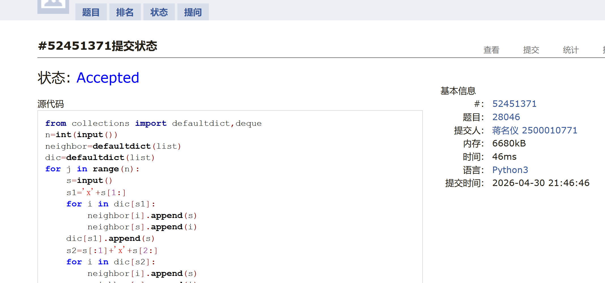
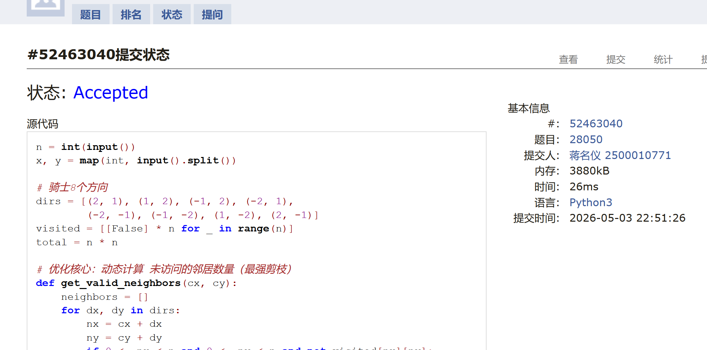

# DSA Assignment #9: 图（1/3）

*Updated 2026-04-28 13:47 GMT+8*
 *Compiled by <mark>同学的姓名、院系</mark> (2026 Spring)*


>**说明：**
>
>1. **解题与记录：**
>
>     对于每一个题目，请提供其解题思路（可选），并附上使用Python或C++编写的源代码（确保已在OpenJudge， Codeforces，LeetCode等平台上获得Accepted）。请将这些信息连同显示“Accepted”的截图一起填写到下方的作业模板中。（推荐使用Typora https://typoraio.cn 进行编辑，当然你也可以选择Word。）无论题目是否已通过，请标明每个题目大致花费的时间。
>
>2. **提交安排：**提交时，请首先上传PDF格式的文件，并将.md或.doc格式的文件作为附件上传至右侧的“作业评论”区。确保你的Canvas账户有一个清晰可见的本人头像，提交的文件为PDF格式，并且“作业评论”区包含上传的.md或.doc附件。
> 
>3. **延迟提交：**如果你预计无法在截止日期前提交作业，请提前告知具体原因。这有助于我们了解情况并可能为你提供适当的延期或其他帮助。  
>
>请按照上述指导认真准备和提交作业，以保证顺利完成课程要求。


## 1. 题目

### M28046: 词梯

bfs, http://cs101.openjudge.cn/practice/28046/

思路：
就是bfs但是好久没写了手生，写了十几分钟


代码：

```python
from collections import defaultdict,deque
n=int(input())
neighbor=defaultdict(list)
dic=defaultdict(list)
for j in range(n):
    s=input()
    s1='x'+s[1:]
    for i in dic[s1]:
        neighbor[i].append(s)
        neighbor[s].append(i)
    dic[s1].append(s)
    s2=s[:1]+'x'+s[2:]
    for i in dic[s2]:
        neighbor[i].append(s)
        neighbor[s].append(i)
    dic[s2].append(s)
    s3=s[:2]+'x'+s[3:]
    for i in dic[s3]:
        neighbor[i].append(s)
        neighbor[s].append(i)
    dic[s3].append(s)
    s4=s[:3]+'x'
    for i in dic[s4]:
        neighbor[i].append(s)
        neighbor[s].append(i)
    dic[s4].append(s)
start,end=input().split()
visited=set()
stack=deque([start])
last={}
if start==end:
    print(start)
    exit()
while stack:
    node=stack.popleft()
    for i in neighbor[node]:
        if i not in visited:
            visited.add(i)
            stack.append(i)
            last[i]=node
            if i==end:
                stack.clear()
                break
if end not in last:
    print('NO')
else:
    res=[end]
    while res[-1]!=start:
        res.append(last[res[-1]])
    print(' '.join(res[::-1]))
```


代码运行截图 <mark>（至少包含有"Accepted"）</mark>



### M433.最小基因变化

bfs, https://leetcode.cn/problems/minimum-genetic-mutation/


思路：
bfs，没什么好说的


代码：

```python
class Solution:
    def minMutation(self, startGene: str, endGene: str, bank: List[str]) -> int:
        dic={'A':0,'C':1,'G':2,'T':3}
        rank=['A','C','G','T']
        bank=set(bank)
        stack=deque([startGene])
        visited=defaultdict(int)
        can=False
        visited[startGene]=1
        if startGene==endGene:
            return 0
        while stack:
            gene=stack.popleft()
            for i in range(8):
                for j in range(3):
                    tar=rank[(dic[gene[i]]+j+1)%4]
                    s=gene[:i]+tar+gene[i+1:]
                    if s in bank and visited[s]==0:
                        if s==endGene:
                            return visited[gene]
                        visited[s]=visited[gene]+1
                        stack.append(s)
        return -1
```


代码运行截图 <mark>（至少包含有"Accepted"）</mark>


### sy382: 有向图判环 中等

Karn, dfs, Floyd-Warshall, https://sunnywhy.com/sfbj/10/3/382

思路：
karn算法的简单应用但是我没看出dfs,,


代码：

```python
n,m=map(int,input().split())
neighbor=[[] for i in range(n)]
edges=[0]*n
for i in range(m):
    a,b=map(int,input().split())
    neighbor[a].append(b)
    edges[b]=edges[b]+1
stack=[]
for i in range(n):
    if edges[i]==0:
        stack.append(i)
while stack:
    node=stack.pop()
    for i in neighbor[node]:
        edges[i]=edges[i]-1
        if edges[i]==0:
            stack.append(i)
if sum(edges)==0:
    print("No")
else:
    print("Yes")
```


代码运行截图 <mark>（至少包含有"Accepted"）</mark>
晴问登陆不了


### M909.蛇梯棋

bfs, https://leetcode.cn/problems/snakes-and-ladders/

思路：

bfs但是太久没写了手生了..

代码：

```python
class Solution:
    def snakesAndLadders(self, board: List[List[int]]) -> int:
        n=len(board)
        li=[-1]*(n**2+1)
        for i in range(n):
            for j in range(n):
                li[i*n+j+1]=board[n-1-i][j] if i%2==0 else board[n-1-i][n-1-j] 
        visited=[0]*(n**2+1)
        visited[1]=1
        stack=deque([(1,0)])
        while stack:
            node,step=stack.popleft()
            for i in range(min(6,n**2-node)):
                if li[node+i+1]!=-1:
                    if li[node+i+1]==n**2:
                        return step+1
                    if not visited[li[node+i+1]]:
                        stack.append((li[node+i+1],step+1))
                        visited[li[node+i+1]]=1
                else:
                    if node+i+1==n**2:
                        return step+1
                    if not visited[node+i+1]:
                        stack.append((node+i+1,step+1))
                        visited[node+i+1]=1
        return -1
```


代码运行截图 <mark>（至少包含有"Accepted"）</mark>


### M28050: 骑士周游

dfs, http://cs101.openjudge.cn/practice/28050/

思路：
刚开始是用了静态的启发式算法，但是还是超时了，后面发现需要用动态的，不得不问了一下ai然后23ms做出来，所以动态的dfs剪枝更厉害？时间复杂度小好多


代码

```python
n = int(input())
x, y = map(int, input().split())

# 骑士8个方向
dirs = [(2, 1), (1, 2), (-1, 2), (-2, 1),
        (-2, -1), (-1, -2), (1, -2), (2, -1)]
visited = [[False] * n for _ in range(n)]
total = n * n

# 优化核心：动态计算 未访问的邻居数量（最强剪枝）
def get_valid_neighbors(cx, cy):
    neighbors = []
    for dx, dy in dirs:
        nx = cx + dx
        ny = cy + dy
        if 0 <= nx < n and 0 <= ny < n and not visited[nx][ny]:
            # 计算下一步的可选步数（Warnsdorff规则）
            cnt = 0
            for dx2, dy2 in dirs:
                if 0 <= nx+dx2 < n and 0 <= ny+dy2 < n and not visited[nx+dx2][ny+dy2]:
                    cnt += 1
            neighbors.append((cnt, nx, ny))
    # 优先走 可选步数最少的（剪枝效率拉满）
    neighbors.sort()
    return [(nx, ny) for cnt, nx, ny in neighbors]

# DFS回溯（精准剪枝，无冗余计算）
def dfs(cx, cy, step):
    if step == total:
        return True
    # 动态获取最优邻居（核心优化，比静态预处理快100倍）
    for nx, ny in get_valid_neighbors(cx, cy):
        visited[nx][ny] = True
        if dfs(nx, ny, step + 1):
            return True
        visited[nx][ny] = False  # 回溯
    return False

visited[x][y] = True
print("success" if dfs(x, y, 1) else "fail")
```


<mark>（至少包含有"Accepted"）</mark>



### T37.解数独

backtracking, hash table, https://leetcode.cn/problems/sudoku-solver/

思路：
按照第五题的逻辑弄了好久，结果发现其实数据小所以直接暴力dfs就是了。。。


代码

```python
class Solution:
    def solveSudoku(self, board: List[List[str]]) -> None:
        # 状态记录：分别记录每一行、每一列以及每一个3x3宫中数字1-9的使用情况
        row = [[False] * 10 for _ in range(9)]
        col = [[False] * 10 for _ in range(9)]
        block = [[False] * 10 for _ in range(9)]

        # 收集所有空格（待填充）的位置
        spaces = []

        # 1. 初始化状态，根据已知数字更新 row, col, block 数组
        for i in range(9):
            for j in range(9):
                if board[i][j] != '.':
                    num = int(board[i][j])
                    row[i][num] = True
                    col[j][num] = True
                    block[(i // 3) * 3 + j // 3][num] = True
                else:
                    spaces.append((i, j))

        # 2. 定义回溯函数
        def dfs(pos: int) -> bool:
            # 基础情况：所有空格都已填满，返回 True 表示找到一个可行解
            if pos == len(spaces):
                return True

            i, j = spaces[pos]
            box = (i // 3) * 3 + j // 3

            for num in range(1, 10):
                # 检查按位是否合法，时间复杂度 O(1)
                if not (row[i][num] or col[j][num] or block[box][num]):
                    # 做选择
                    board[i][j] = str(num)
                    row[i][num] = col[j][num] = block[box][num] = True

                    # 递归到下一个空格
                    if dfs(pos + 1):
                        return True

                    # 撤销选择（回溯）
                    board[i][j] = '.'
                    row[i][num] = col[j][num] = block[box][num] = False

            # 如果数字 1-9 都尝试过了且都不行，则说明此路不通，触发回溯
            return False

        # 3. 从第 0 个空格开始求解
        dfs(0)
```


<mark>（至少包含有"Accepted"）</mark>


## 2. 学习总结和个人收获

<mark>如果发现作业题目相对简单，有否寻找额外的练习题目，如“数算2026spring每日选做”、LeetCode、Codeforces、洛谷等网站上的题目。</mark>
写了这个作业我才发现对bfs,dfs都手生了。。还是要多练才行了


