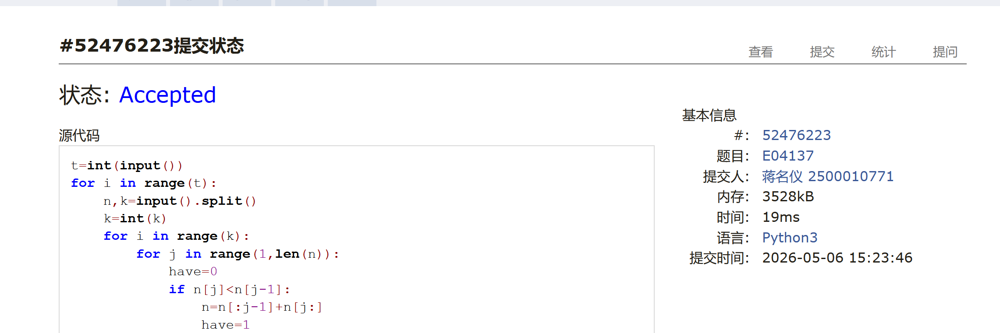
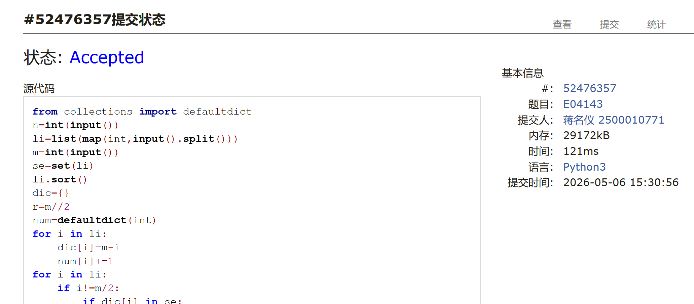
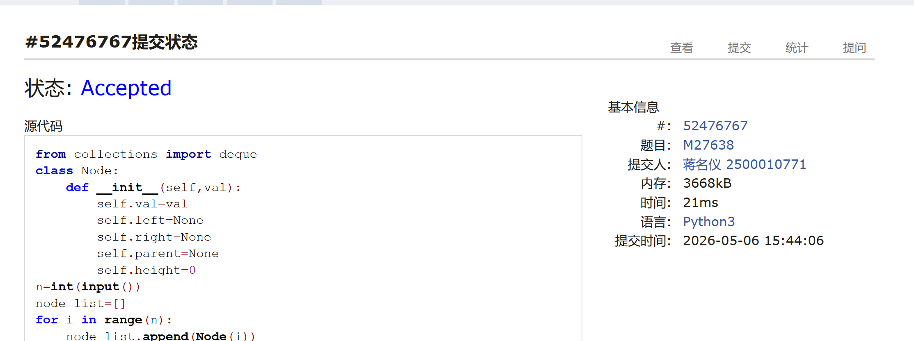
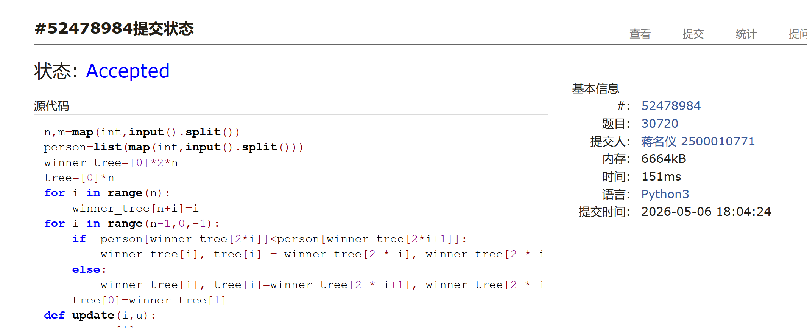
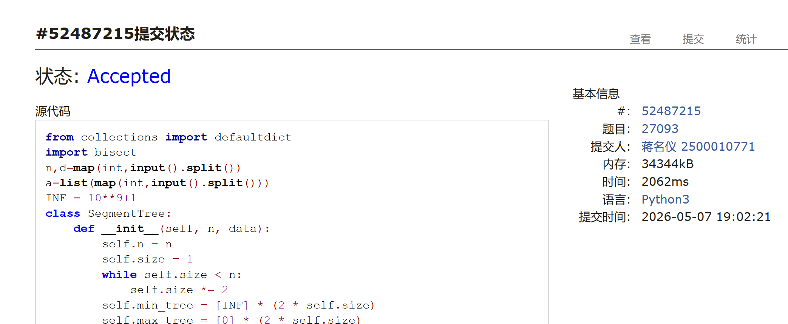
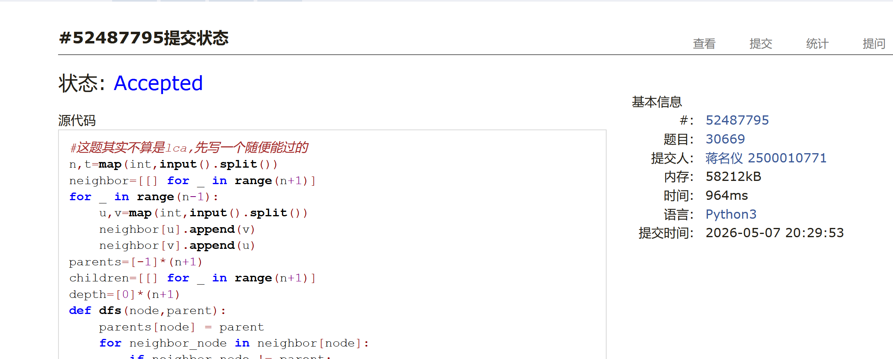

# DSA Assignment #A: 5月份月考

*Updated 2026-05-06 15:43 GMT+8*
 *Compiled by <mark>同学的姓名、院系</mark> (2026 Spring)*


>**说明：**
>
>1. **解题与记录：**
>
>     对于每一个题目，请提供其解题思路（可选），并附上使用Python或C++编写的源代码（确保已在OpenJudge， Codeforces，LeetCode等平台上获得Accepted）。请将这些信息连同显示“Accepted”的截图一起填写到下方的作业模板中。（推荐使用Typora https://typoraio.cn 进行编辑，当然你也可以选择Word。）无论题目是否已通过，请标明每个题目大致花费的时间。
>
>2. **提交安排：**提交时，请首先上传PDF格式的文件，并将.md或.doc格式的文件作为附件上传至右侧的“作业评论”区。确保你的Canvas账户有一个清晰可见的本人头像，提交的文件为PDF格式，并且“作业评论”区包含上传的.md或.doc附件。
> 
>3. **延迟提交：**如果你预计无法在截止日期前提交作业，请提前告知具体原因。这有助于我们了解情况并可能为你提供适当的延期或其他帮助。  
>
>请按照上述指导认真准备和提交作业，以保证顺利完成课程要求。


## 1. 题目

### E04137: 最小新整数 

monotonic stack, http://cs101.openjudge.cn/practice/04137/

思路：
贪心


代码：

```python
t=int(input())
for i in range(t):
    n,k=input().split()
    k=int(k)
    for i in range(k):
        for j in range(1,len(n)):
            have=0
            if n[j]<n[j-1]:
                n=n[:j-1]+n[j:]
                have=1
                break
        if have==0:
            n=n[:-1]
    print(n)
```


代码运行截图 <mark>（至少包含有"Accepted"）</mark>



### E04143: 和为给定数 

two pointers, http://cs101.openjudge.cn/dsapre/04143/


思路：
用字典硬做的


代码：

```python
from collections import defaultdict
n=int(input())
li=list(map(int,input().split()))
m=int(input())
se=set(li)
li.sort()
dic={}
r=m//2
num=defaultdict(int)
for i in li:
    dic[i]=m-i
    num[i]+=1
for i in li:
    if i!=m/2:
        if dic[i] in se:
            print(i,dic[i])
            exit()
    else:
        if num[i]>=2:
            print(i,dic[i])
            exit()
print('No')
```


代码运行截图 <mark>（至少包含有"Accepted"）</mark>



### M27638: 求二叉树的高度和叶子数目

http://cs101.openjudge.cn/practice/27638/

思路：
树


代码：

```python
from collections import deque
class Node:
    def __init__(self,val):
        self.val=val
        self.left=None
        self.right=None
        self.parent=None
        self.height=0
n=int(input())
node_list=[]
for i in range(n):
    node_list.append(Node(i))
for i in range(n):
    left,right=map(int,input().split())
    if left!=-1:
        node_list[i].left=node_list[left]
        stack=deque([node_list[i]])
        while stack:
            node=stack.popleft()
            if node.right:
                node.right.height=node.height+1
                stack.append(node.right)
            if node.left:
                node.left.height=node.height+1
                stack.append(node.left)
    if right!=-1:
        node_list[right].height=node_list[i].height+1
        node_list[i].right=node_list[right]
        stack=deque([node_list[i]])
        while stack:
            node=stack.pop()
            if node.left:
                node.left.height=node.height+1
                stack.append(node.left)
            if node.right:
                node.right.height=node.height+1
                stack.append(node.right)
leaves=0
heights=0
for i in range(n):
    if not node_list[i].left and not node_list[i].right:
        leaves+=1
        heights=max(heights,node_list[i].height)
print(heights,leaves)
```


代码运行截图 <mark>（至少包含有"Accepted"）</mark>



### M30720: 败方树的构建与维护

http://cs101.openjudge.cn/practice/30720/

思路：
类似线段树的想法但是不用区间最大最小所以好写


代码：

```python
n,m=map(int,input().split())
person=list(map(int,input().split()))
winner_tree=[0]*2*n
tree=[0]*n
for i in range(n):
    winner_tree[n+i]=i
for i in range(n-1,0,-1):
    if  person[winner_tree[2*i]]<person[winner_tree[2*i+1]]:
        winner_tree[i], tree[i] = winner_tree[2 * i], winner_tree[2 * i + 1]
    else:
        winner_tree[i], tree[i]=winner_tree[2 * i+1], winner_tree[2 * i ]
    tree[0]=winner_tree[1]
def update(i,u):
    person[i]=u
    cur=(i+n)//2
    while cur>0 :
        if person[winner_tree[2 * cur]] < person[winner_tree[2 * cur + 1]]:
            winner_tree[cur], tree[cur] = winner_tree[2 * cur], winner_tree[2 * cur + 1]
        else:
            winner_tree[cur], tree[cur] = winner_tree[2 * cur + 1], winner_tree[2 * cur]
        cur//=2
    winner_tree[0],tree[0]=winner_tree[1],winner_tree[1]
def show():
    result=[person[tree[i]] for i in range(n)]
    print(' '.join(map(str,result)))
show()
for j in range(m):
    i,u=map(int,input().split())
    update(i,u)
    show()
```


代码运行截图 <mark>（至少包含有"Accepted"）</mark>



### 27093: 排队又来了

Segment Tree, Discretization（离散化）, binary search, http://cs101.openjudge.cn/practice/27093/

思路：
回去又看了一遍题解自己咬牙写了一遍。。。其实上个学期写过排队所以知道排队应该怎么写，但是不知道怎么优化时间复杂度，看完题解才恍然大悟，就是要找最大的挡住自己的层数这样，所以相当于是求区间最大最小值；然后数据太大所以要离散化，离散化所以要二分查找端点，好难。。


代码

```python
from collections import defaultdict
import bisect
n,d=map(int,input().split())
a=list(map(int,input().split()))
INF = 10**9+1
class SegmentTree:
    def __init__(self, n, data):
        self.n = n
        self.size = 1
        while self.size < n:
            self.size *= 2
        self.min_tree = [INF] * (2 * self.size)
        self.max_tree = [0] * (2 * self.size)
        for i in range(n):
            self.min_tree[self.size + i] = data[i]
            self.max_tree[self.size + i] = data[i]
        for i in range(n, self.size):
            self.min_tree[self.size + i] = INF
            self.max_tree[self.size + i] = 0
        for i in range(self.size-1, 0, -1):
            self.min_tree[i] = min(self.min_tree[2*i], self.min_tree[2*i+1])
            self.max_tree[i] = max(self.max_tree[2*i], self.max_tree[2*i+1])

    def update(self, index, value):
        i = self.size + index  # 计算在线段树数组中的位置
        if value==None:
            self.min_tree[i] = INF  # 将该位置的最小值标记为无穷大（表示已删除）
            self.max_tree[i] = 0  # 将该位置的最大值标记为负无穷大（表示已删除）
        else:
            self.min_tree[i] = value  # 更新该位置的最小值
            self.max_tree[i] = value  # 更新该位置的最大值
            i //= 2  # 移动到父节点
        while i:  # 循环更新所有祖先节点，直到根节点
            self.min_tree[i] = min(self.min_tree[2*i], self.min_tree[2*i+1])  # 更新父节点的最小值
            self.max_tree[i] = max(self.max_tree[2*i], self.max_tree[2*i+1])  # 更新父节点的最大值
            i //= 2  # 继续向上移动到更高级的父节点

    def query(self, l, r):
        l += self.size  # 将原始索引转换为线段树中的叶子节点索引
        r += self.size  # 将原始索引转换为线段树中的叶子节点索引
        res_min = INF   # 初始化最小值为无穷大
        res_max = 0  # 初始化最大值为负无穷大
        while l < r:    # 当查询区间不为空时循环
            if l & 1:   # 如果 l 是右子节点（奇数索引）
                res_min = min(res_min, self.min_tree[l])  # 更新最小值
                res_max = max(res_max, self.max_tree[l])  # 更新最大值
                l += 1  # 将 l 向右移动一位
            if r & 1:   # 如果 r 是右子节点（奇数索引）
                r -= 1  # 先将 r 向左移动一位
                res_min = min(res_min, self.min_tree[r])  # 更新最小值
                res_max = max(res_max, self.max_tree[r])  # 更新最大值
            l //= 2     # 将 l 移动到父节点层
            r //= 2     # 将 r 移动到父节点层
        return (res_min, res_max)  # 返回查询结果
vals=sorted(set(a))
val_to_idx = {v: i for i, v in enumerate(vals)}
m=len(vals)
layer=[0]*m
layer[val_to_idx[a[0]]]=1
st=SegmentTree(m,layer)
cur_queue=[[a[0]]]
for i in range(1,n):
    left=bisect.bisect_left(vals,a[i]-d)
    right=bisect.bisect_right(vals,a[i]+d)
    l1,r1=st.query(0,left) if left>0 else (INF,0)
    l2,r2=st.query(right,m) if right<m else (INF,0)
    layer[val_to_idx[a[i]]]=max(r1,r2)+1
    if layer[val_to_idx[a[i]]]>len(cur_queue):
        cur_queue.append([a[i]])
    else:
        cur_queue[layer[val_to_idx[a[i]]]-1].append(a[i])
    st.update(val_to_idx[a[i]],layer[val_to_idx[a[i]]])
ans=[]
for j in cur_queue:
    j.sort()
    ans.extend(j)
print(' '.join(map(str,ans)))
```


<mark>（至少包含有"Accepted"）</mark>



### T30669: 地铁换乘

LCA, binary lifting, http://cs101.openjudge.cn/practice/30669/

思路：
不算lca,所以随便写了一个能过的，lca的话就是用倍增法+st表，或者dfs序，这周时间太赶了所以没有学其他的方法。


代码

```python
#这题其实不算是lca,先写一个随便能过的
n,t=map(int,input().split())
neighbor=[[] for _ in range(n+1)]
for _ in range(n-1):
    u,v=map(int,input().split())
    neighbor[u].append(v)
    neighbor[v].append(u)
parents=[-1]*(n+1)
children=[[] for _ in range(n+1)]
depth=[0]*(n+1)
def dfs(node,parent):
    parents[node] = parent
    for neighbor_node in neighbor[node]:
        if neighbor_node != parent:
            depth[neighbor_node]=depth[node]+1
            children[node].append(neighbor_node)
            dfs(neighbor_node, node)
dfs(t,-1)
p,q,v1,v2=map(int,input().split())
def get_path(node1,node2):
    path1_to_ancestor=[]
    path2_to_ancestor=[]
    while depth[node2]>depth[node1]:
        path2_to_ancestor.append(node2)
        node2=parents[node2]
    while depth[node1]>depth[node2]:
        path1_to_ancestor.append(node1)
        node1=parents[node1]
    while node1!=node2:
        path1_to_ancestor.append(node1)
        path2_to_ancestor.append(node2)
        node1=parents[node1]
        node2=parents[node2]
    path=path1_to_ancestor+[node1]+path2_to_ancestor[::-1]
    return path
path=get_path(p,q)
days=(len(path)-1)//(v1+v2)
station=path[days*v1]
print(days,depth[station])
```


<mark>（至少包含有"Accepted"）</mark>




## 2. 学习总结和个人收获

<mark>如果发现作业题目相对简单，有否寻找额外的练习题目，如“数算2026spring每日选做”、LeetCode、Codeforces、洛谷等网站上的题目。</mark>
还是菜就多练。


