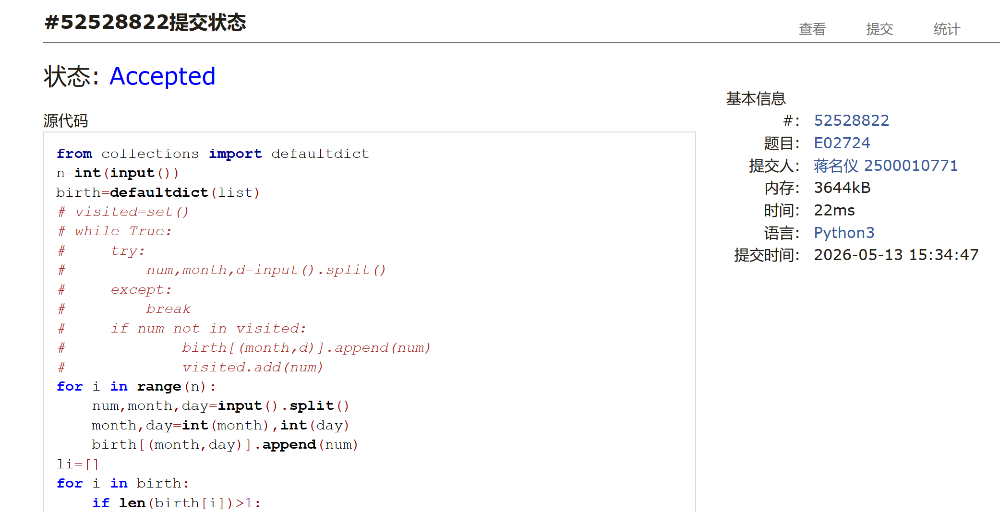
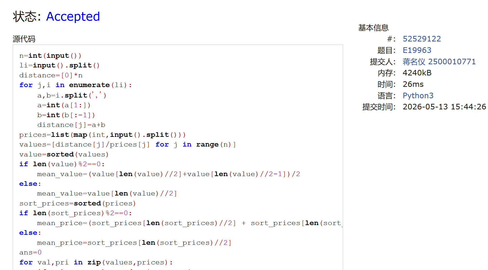
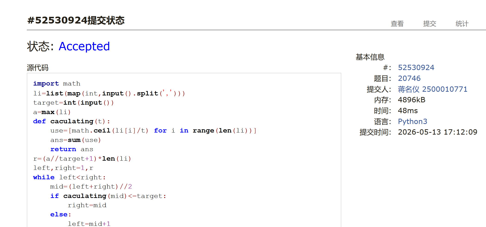
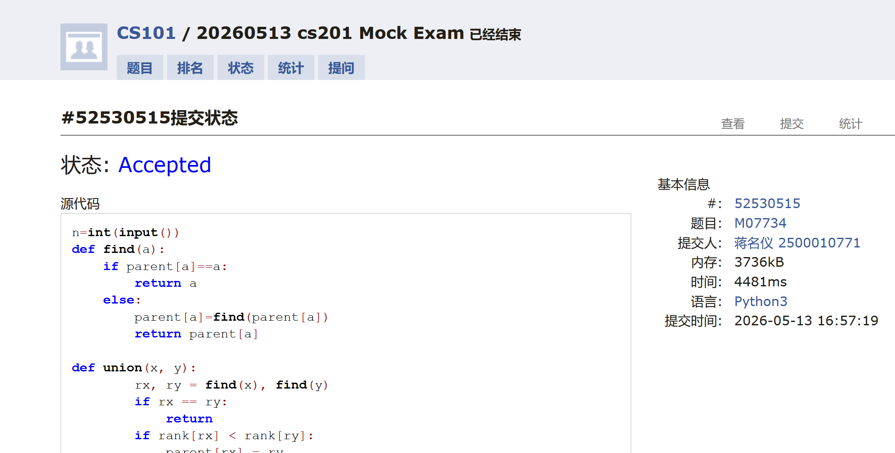
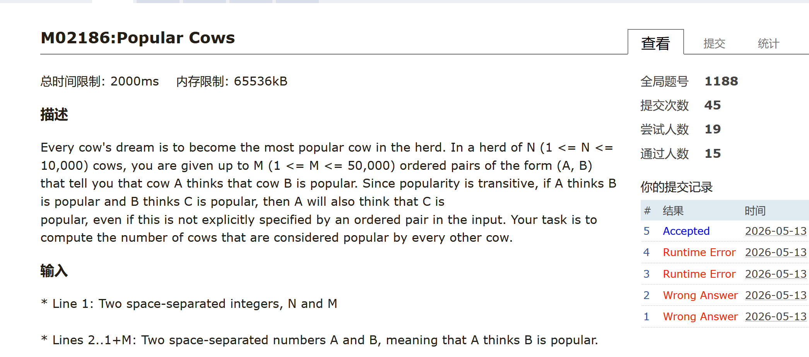
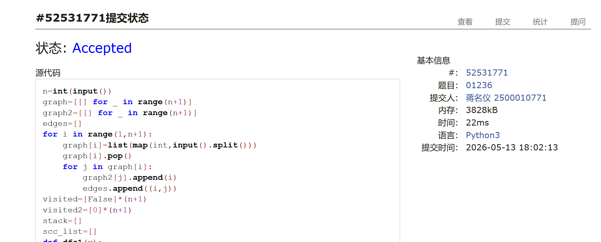

# DSA Assignment #B: 20260513模拟考

*Updated 2026-05-13 13:35 GMT+8*
 *Compiled 蒋名仪 (2026 Spring)*


>**说明：**
>
>1. **解题与记录：**
>
>     对于每一个题目，请提供其解题思路（可选），并附上使用Python或C++编写的源代码（确保已在OpenJudge， Codeforces，LeetCode等平台上获得Accepted）。请将这些信息连同显示“Accepted”的截图一起填写到下方的作业模板中。（推荐使用Typora https://typoraio.cn 进行编辑，当然你也可以选择Word。）无论题目是否已通过，请标明每个题目大致花费的时间。
>
>2. **提交安排：**提交时，请首先上传PDF格式的文件，并将.md或.doc格式的文件作为附件上传至右侧的“作业评论”区。确保你的Canvas账户有一个清晰可见的本人头像，提交的文件为PDF格式，并且“作业评论”区包含上传的.md或.doc附件。
> 
>3. **延迟提交：**如果你预计无法在截止日期前提交作业，请提前告知具体原因。这有助于我们了解情况并可能为你提供适当的延期或其他帮助。  
>
>请按照上述指导认真准备和提交作业，以保证顺利完成课程要求。


## 1. 题目

### E02724: 生日相同

sortings, http://cs101.openjudge.cn/pctbook/E02724/

思路：
hash表，一定一定要注意字符串的比较是一位一位来比的所以比较要转化为整数。。


代码：

```python
from collections import defaultdict
n=int(input())
birth=defaultdict(list)
# visited=set()
# while True:
#     try:
#         num,month,d=input().split()
#     except:
#         break
#     if num not in visited:
#             birth[(month,d)].append(num)
#             visited.add(num)
for i in range(n):
    num,month,day=input().split()
    month,day=int(month),int(day)
    birth[(month,day)].append(num)
li=[]
for i in birth:
    if len(birth[i])>1:
        li.append(i)
li.sort()
for m,d in li:
    print(m,d,' '.join(birth[(m,d)]))
```


代码运行截图 <mark>（至少包含有"Accepted"）</mark>




### E19963: 买学区房

math, http://cs101.openjudge.cn/practice/19963


思路：
简单的排序没什么好说的


代码：

```python
n=int(input())
li=input().split()
distance=[0]*n
for j,i in enumerate(li):
    a,b=i.split(',')
    a=int(a[1:])
    b=int(b[:-1])
    distance[j]=a+b
prices=list(map(int,input().split()))
values=[distance[j]/prices[j] for j in range(n)]
value=sorted(values)
if len(value)%2==0:
    mean_value=(value[len(value)//2]+value[len(value)//2-1])/2
else:
    mean_value=value[len(value)//2]
sort_prices=sorted(prices)
if len(sort_prices)%2==0:
    mean_price=(sort_prices[len(sort_prices)//2] + sort_prices[len(sort_prices)//2-1])/2
else:
    mean_price=sort_prices[len(sort_prices)//2]
ans=0
for val,pri in zip(values,prices):
    if val>mean_value and pri<mean_price:
        ans+=1
print(ans)
```


代码运行截图 <mark>（至少包含有"Accepted"）</mark>



### M20746: 满足合法工时的最少人数

binary search, http://cs101.openjudge.cn/practice/20746/

思路：
二分查找，考试刚结束就做出来了也是有点遗憾


代码：

```python
import math
li=list(map(int,input().split(',')))
target=int(input())
a=max(li)
def caculating(t):
    use=[math.ceil(li[i]/t) for i in range(len(li))]
    ans=sum(use)
    return ans
r=(a//target+1)*len(li)
left,right=1,r
while left<right:
    mid=(left+right)//2
    if caculating(mid)<=target:
        right=mid
    else:
        left=mid+1
print(left)
```


代码运行截图 <mark>（至少包含有"Accepted"）</mark>



### M07734: 虫子的生活

DSU, http://cs101.openjudge.cn/practice/07734/

思路：
双倍并查集，类似食物链


代码：

```python
n=int(input())
def find(a):
    if parent[a]==a:
        return a
    else:
        parent[a]=find(parent[a])
        return parent[a]

def union(x, y):
        rx, ry = find(x), find(y)
        if rx == ry:
            return
        if rank[rx] < rank[ry]:
            parent[rx] = ry
        elif rank[rx] > rank[ry]:
            parent[ry] = rx
        else:
            parent[ry] = rx
            rank[rx] += 1
for i in range(n):
    print(f'Scenario #{i+1}:')
    can=0
    k,num=map(int,input().split())
    parent=list(range(2*k+1))
    rank=[0]*(2*k+1)
    com_num=[-1]*(k+1)
    for j in range(num):
        a,b=map(int,input().split())
        if find(a)==find(b):
            can=1
        else:
            union(a,b+k)
            union(b,a+k)
    if can==0:
        print('No suspicious bugs found!')
    else:
        print('Suspicious bugs found!')
    print()
```


代码运行截图 <mark>（至少包含有"Accepted"）</mark>



### M02186: Popular Cows

SCC, http://cs101.openjudge.cn/practice/02186/

思路：
scc 缩点+找所有出度为0的点+并查集查看是否有序关系，由于scc不熟悉做了好久但其实用完scc就是一个比较简单的题


代码

```python
from collections import defaultdict,deque
import sys
sys.setrecursionlimit(10**7)
n,m=map(int,input().split())
graph=defaultdict(list)
graph2=defaultdict(list)
edges=[]
for i in range(m):
    a,b=map(int,input().split())
    graph[a].append(b)
    graph2[b].append(a)
    edges.append((a,b))
visited=[False]*(n+1)
visited2=[0]*(n+1)
stack=[]
scc_list=[]
def dfs1(v):
    visited[v]=True
    for i in graph[v]:
        if not visited[i]:
            dfs1(i)
    stack.append(v)
for i in range(1,n+1):
    if not visited[i]:
        dfs1(i)
comp={}
def dfs2(v,component,j):
    visited2[v]=1
    comp[v]=j
    component.append(v)
    for i in graph2[v]:
        if not visited2[i]:
            dfs2(i,component,j)
while stack:
    v=stack.pop()
    if not visited2[v]:
        component=[]
        j=len(scc_list)
        dfs2(v,component,j)
        scc_list.append(component)
parent=[i for i in range(len(scc_list))]
def find(a):
    if parent[a]==a:
        return a
    else:
        parent[a]=find(parent[a])
        return parent[a]
out_edges=[0]*(len(scc_list))
for a,b in edges:
    if find(comp[a]) != find(comp[b]):
        parent[parent[comp[a]]]=parent[comp[b]]
        out_edges[comp[a]]+=1
#
# stack2=deque()
# for i in range(len(scc_list)):
#     if inedges[i]==0:
#         stack2.append(i)
# while stack2:
#     v=stack2.popleft()
#
ans=0
if len(scc_list)==1:
    print(n)
    exit()
anc=0
for i in range(len(scc_list)):
    if out_edges[i]==0:
        anc+=1
        ans_index=i
if anc!=1:
    print(0)
    exit()
else:
    for i in range(len(scc_list)):
        if find(i) != ans_index:
            print(0)
            exit()
    print(len(scc_list[ans_index]))
```


<mark>（至少包含有"Accepted"）</mark>



### T01236: Network of Schools 238

SCC, http://cs101.openjudge.cn/practice/01236/

思路：

scc+脑筋急转弯，只要出度为0的点接上入度为0的点基本上就是都可以去，但是一定要注意只有一个scc块的时候就已经说明都可以到了

代码

```python
n=int(input())
graph=[[] for _ in range(n+1)]
graph2=[[] for _ in range(n+1)]
edges=[]
for i in range(1,n+1):
    graph[i]=list(map(int,input().split()))
    graph[i].pop()
    for j in graph[i]:
        graph2[j].append(i)
        edges.append((i,j))
visited=[False]*(n+1)
visited2=[0]*(n+1)
stack=[]
scc_list=[]
def dfs1(v):
    visited[v]=True
    for i in graph[v]:
        if not visited[i]:
            dfs1(i)
    stack.append(v)
for i in range(1,n+1):
    if not visited[i]:
        dfs1(i)
comp={}
def dfs2(v,component,j):
    visited2[v]=1
    comp[v]=j
    component.append(v)
    for i in graph2[v]:
        if not visited2[i]:
            dfs2(i,component,j)
while stack:
    v=stack.pop()
    if not visited2[v]:
        component=[]
        j=len(scc_list)
        dfs2(v,component,j)
        scc_list.append(component)
if len(scc_list)==1:
    print(1)
    print(0)
    exit()
parent=[i for i in range(len(scc_list))]
def find(a):
    if parent[a]==a:
        return a
    else:
        parent[a]=find(parent[a])
        return parent[a]
out_edges=[0]*(len(scc_list))
in_edges=[0]*(len(scc_list))
for a,b in edges:
    if comp[a]!=comp[b]:
        out_edges[comp[a]]+=1
        in_edges[comp[b]]+=1
ans1=0
for j in range(len(scc_list)):
    if in_edges[j]==0:
        ans1+=1
print(ans1)
ans2=0
for j in range(len(scc_list)):
    if out_edges[j]==0:
        ans2+=1
print(max(ans2,ans1))
```


<mark>（至少包含有"Accepted"）</mark>




## 2. 学习总结和个人收获

<mark>如果发现作业题目相对简单，有否寻找额外的练习题目，如“数算2026spring每日选做”、LeetCode、Codeforces、洛谷等网站上的题目。</mark>
这次月考着重练习了scc的写法，有点意想不到的是居然最小生成树、单源最短路、多源最短路、拓扑排序相关的问题一个都没出，希望下次出来复习一下
还有就是，我有点不太清楚哪些在期末考试考纲范围内哪些不在，比如我现在还是不知道aoe,avl树这种在不在考纲里面，希望闫老师能再详细说一下。


